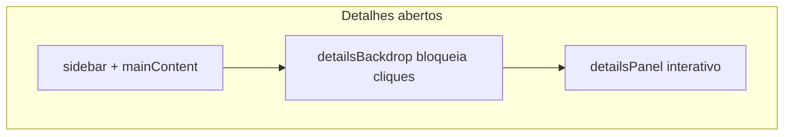

# Bestiary: bloqueio do fundo + barra de progresso

## 1. Bloquear cliques no Bestiary com detalhes abertos

**Concordo com a ideia** — o `detailsPanel` ocupa só ~360px à direita; sidebar + grid continuam clicáveis e permitem trocar de criatura “por baixo” do painel.

### Solução (escolha do usuário: só bloquear, sem fechar)

Adicionar **`detailsBackdrop`** em [`bestiary.otui`](c:\8.6\otserv_860\otc-server\client\modules\game_bestiary\bestiary.otui):

- `UIWidget` com `anchors.fill: parent` (cobre sidebar + `mainContent`, **não** o `detailsPanel`)
- `background-color: #00000055` — escurecimento leve
- `visible: false` por padrão; `phantom: false` — absorve cliques
- Inserir **antes** de `detailsPanel` no OTUI (z-order: backdrop abaixo, detalhes acima)

Em [`bestiary.lua`](c:\8.6\otserv_860\otc-server\client\modules\game_bestiary\bestiary.lua):

```lua
-- showCreatureDetails
backdrop:setVisible(true)
panel:setVisible(true)
panel:raise()
closeBtn:raise()

-- hideDetails
backdrop:setVisible(false)
```

Sem `@onClick` no backdrop (apenas bloqueio).



---

## 2. Barra de progresso não aparece (imagem 2)

### Causa

Em [`bestiary.otui`](c:\8.6\otserv_860\otc-server\client\modules\game_bestiary\bestiary.otui) L626–631:

```otui
ProgressBar
  id: detailProgress
  background-color: #111111ff    // COR DO FILL — quase preto
  image-source: /images/ui/progressbar
  image-color: #00ffccff         // ciano — NÃO pinta o fill
```

No OTC, `UIProgressBar` preenche via **`background-color` + `setBackgroundRect()`** ([`uiprogressbar.lua`](c:\8.6\otserv_860\otc-server\client\modules\corelib\ui\uiprogressbar.lua) L62–68). O fill fica **preto sobre painel escuro** → parece vazio.

Compare com o **card** que funciona (L74–77): `background-color: #00ffccff` sem depender de `image-color`.

O label `58/25` funciona; `setValue` também (valor capped em `maximum` = barra cheia).

### Correção

Alinhar ao padrão **Prey** / **card do Bestiary**:

| Propriedade | Antes | Depois |
|-------------|-------|--------|
| `background-color` | `#111111ff` (fill) | **`#ffd700ff`** (dourado/amarelo — pedido do usuário) |
| `image-source` | `/images/ui/progressbar` | **remover** (evita conflito visual) |
| `image-color` | `#00ffccff` | **remover** |
| Trilho vazio | — | `border: 1 #333333ff` ou painel pai `#0a1212` já contrasta |

Opcional: faixa de trilho com `FlatPanel` atrás (height 10, `#1a1a1aff`) se precisar mais contraste.

Em **`updateDetailProgress()`** ([`bestiary.lua`](c:\8.6\otserv_860\otc-server\client\modules\game_bestiary\bestiary.lua) L685–693):

- Após `setValue`, chamar `progressBar:updateBackground()` (força redraw após layout)
- `addEvent` 50ms após abrir detalhes como fallback de geometry (mesmo padrão de `scheduleDetailScrollRefresh`)

Contador `58/25` permanece; barra mostra **100%** (valor capped em `maximum`).

---

## 3. Documentação

Uma linha em [`client/docs/BESTIARY-MODULE.md`](c:\8.6\otserv_860\otc-server\client\docs\BESTIARY-MODULE.md): backdrop bloqueia grid; progresso dourado `#ffd700`.

---

## Teste manual

1. Abrir Bestiary → clicar **Rotworm** → tentar clicar card **atrás** → **não** troca criatura; fundo levemente escurecido
2. Fechar (X) → grid clicável de novo
3. Rotworm 58/25 → barra **amarela/dourada** visível e cheia; label `58/25` OK
4. Criatura 0/25 → barra vazia (só trilho escuro)

---

## Arquivos

| Arquivo | Mudança |
|---------|---------|
| [`bestiary.otui`](c:\8.6\otserv_860\otc-server\client\modules\game_bestiary\bestiary.otui) | `detailsBackdrop`; fix `detailProgress` cores |
| [`bestiary.lua`](c:\8.6\otserv_860\otc-server\client\modules\game_bestiary\bestiary.lua) | show/hide backdrop; `updateBackground()` |
| [`BESTIARY-MODULE.md`](c:\8.6\otserv_860\otc-server\client\docs\BESTIARY-MODULE.md) | Nota UX |
