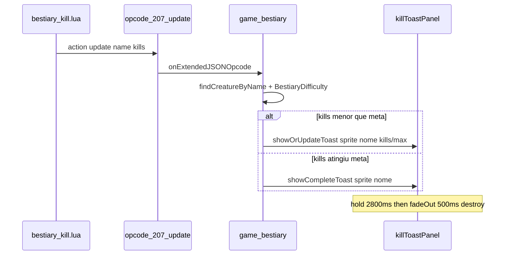
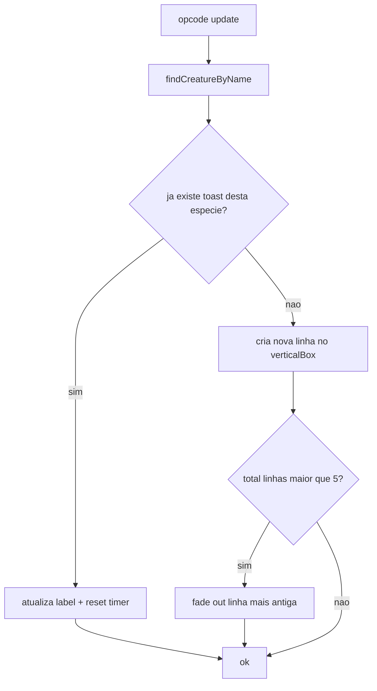

# Bestiary — toasts de kill no mapa

## Objetivo

Ao matar um monstro **rastreado pelo bestiary** que ainda **não está completo**, exibir no **canto superior esquerdo do `gameMapPanel`**:

`[looktype] Nome  5/25`

Comportamentos acordados:

| Situação | Comportamento |
|----------|----------------|
| Várias mortes do **mesmo** monstro quase juntas (AoE/combo) | **Uma linha** que atualiza o contador (ex.: `Rotworm 4/25`) |
| Mortes de **espécies diferentes** | Até **5 linhas** empilhadas verticalmente |
| Monstro **completa** o bestiary | Toast especial curto: *"Rotworm — Bestiary completo!"* |
| Tempo na tela | ~**2,8 s** parado → **0,5 s** fade out → remove; linhas restantes **sobem** (reflow do layout) |

Sem alteração obrigatória no servidor — o pacote `update` já envia `{ name, kills }` via [`bestiary_kill.lua`](c:\8.6\otserv_860\otc-server\server\data\creaturescripts\scripts\bestiary_kill.lua).



---

## Onde ancorar na UI

Seguir o mesmo padrão de [`textmessage.otui`](c:\8.6\otserv_860\otc-server\client\modules\game_textmessage\textmessage.otui): painel **phantom** filho de `gameMapPanel`, canto superior esquerdo com margem (~12 px), **fora** dos painéis laterais — coincide com o retângulo amarelo do mockup.

```
gameMapPanel
  └── bestiaryKillToastPanel (phantom, top-left)
        └── verticalBox (max 5 filhos BestiaryKillToast)
```

---

## Arquivos a criar/alterar

| Arquivo | Mudança |
|---------|---------|
| **Novo** [`bestiary_killtoast.otui`](c:\8.6\otserv_860\otc-server\client\modules\game_bestiary\bestiary_killtoast.otui) | Widget `BestiaryKillToast` (linha ~220×30) + container |
| [`bestiary.lua`](c:\8.6\otserv_860\otc-server\client\modules\game_bestiary\bestiary.lua) | Manager de toasts + hook no `action == "update"` |
| [`client_options/options.lua`](c:\8.6\otserv_860\otc-server\client\modules\client_options\options.lua) | Toggle `showBestiaryKillToasts` (default `true`) — opcional mas recomendado para bot/farm |
| [`BESTIARY-MODULE.md`](c:\8.6\otserv_860\otc-server\client\docs\BESTIARY-MODULE.md) | Seção "Kill toasts" + constantes + troubleshooting |

**Não** criar módulo separado — mantém opcode 207 e dados do JSON no mesmo `game_bestiary`.

---

## Layout da linha (`BestiaryKillToast`)

- `FlatPanel` semi-transparente (`#000000aa`, border `#00ffcc44`)
- `UICreature` **32×32**, `phantom`, `setAnimate(false)`, `setScale(0.55)` — **sem** rotação auto (economia de FPS)
- `Label` truncado: `Rotworm  5/25` ou estilo `Nome · 5/25`
- Variante **complete**: border `#ffd700`, texto dourado, sem contador

Reutilizar [`applyCreatureOutfit()`](c:\8.6\otserv_860\otc-server\client\modules\game_bestiary\bestiary.lua) já existente.

---

## Lógica do manager (Lua)

Constantes sugeridas:

```lua
KILL_TOAST_HOLD_MS = 2800
KILL_TOAST_FADE_MS = 500
KILL_TOAST_MAX_VISIBLE = 5
```

Funções principais:

| Função | Papel |
|--------|-------|
| `initKillToasts()` / `terminateKillToasts()` | `loadUI` no `getMapPanel()`, limpar no `onGameEnd` |
| `showProgressToast(creature, kills, maxKills)` | Cria ou **atualiza** linha existente com mesmo `name:lower()` |
| `showCompleteToast(creature)` | Remove linha de progresso da espécie; exibe toast de conclusão |
| `scheduleToastExpire(widget)` | Reseta timer ao atualizar; ao expirar → `g_effects.fadeOut` → `destroy` |
| `enforceMaxVisible()` | Se > 5 espécies distintas, fade-out imediato do **mais antigo** |

Hook em `onExtendedJSONOpcode` — bloco `update`:

1. Atualizar `creature.kills` (já existe)
2. Ignorar se `showBestiaryKillToasts == false`
3. Ignorar se criatura não está no JSON
4. `maxKills = BestiaryDifficulty[creature.difficulty].kills`
5. Se `kills >= maxKills` → `showCompleteToast`
6. Senão → `showProgressToast`

**Não** disparar toasts em `action == "sync"` (login/relog) — evita spam de centenas de linhas.

---

## Várias mortes ao mesmo tempo — estratégia



- **Mesma espécie:** uma linha, contador sobe, timer reinicia (atende AoE/combo).
- **Espécies diferentes:** empilha até 5; a 6ª expulsa a mais antiga.
- **Pacotes `update` sequenciais** do TFS (um `onKill` por corpo) chegam em milissegundos — a deduplicação por nome cobre o caso sem debounce extra.

---

## Performance (FPS)

| Risco | Mitigação |
|-------|-----------|
| `UICreature` animado | `setAnimate(false)`, sprite pequeno, escala baixa |
| Criar/destruir widgets | Máx. **5** ativos; pool opcional se perfilar lag |
| Spam em hunt | Toggle nas opções; cap 5 linhas; sem toast no `sync` |
| `refreshMonsterGridIfVisible` | Já só roda com modal aberto — manter |
| Fade | Reutilizar [`g_effects.fadeOut`](c:\8.6\otserv_860\otc-server\client\modules\corelib\ui\effects.lua) (30 ms steps) — barato |
| Looks ainda não sync | Fallback `lookId` do JSON; se 0, linha só com texto (sem sprite) |

Meta: **≤ 5 UICreature estáticos** no overlay — impacto desprezível vs. dezenas no grid do Bestiary.

---

## O que mais prever (documentar no MD)

- **Monstro fora do JSON:** servidor não envia `update` — sem toast (OK).
- **Summon / player kill:** filtrado no servidor — sem toast.
- **Completou off-line:** no próximo kill já completo — só toast de complete se contador cruzar meta na sessão (comportamento natural).
- **Bestiary aberto:** toasts continuam no mapa (não conflita com modal).
- **Layout modern / mobile:** painel phantom no mapa escala com viewport; testar margem top se `gameTopBar` sobrepor.
- **i18n:** strings PT (`Bestiary completo!`) via `tr()`.
- **Futuro:** som discreto, cor por dificuldade, opção de posição (top-right), batch server-side (não necessário agora).

---

## Teste manual

1. Reiniciar cliente; login com kills parciais em Rotworm.
2. Matar 1 rotworm → toast `Rotworm 6/25` (ou N+1) no canto superior esquerdo.
3. Matar 4 rotworms em combo → **uma linha** sobe para `9/25`, timer reinicia.
4. Matar rat + rotworm alternado → 2 linhas empilhadas.
5. Completar 25/25 → toast dourado *"Rotworm — Bestiary completo!"*; kills seguintes **sem** toast de progresso.
6. Desligar opção → nenhum toast.
7. Verificar FPS estável com 5 espécies diferentes em fila.

---

## Escopo fora desta entrega

- Alterar payload do servidor (opcional futuro: enviar `maxKills` no `update`).
- Tela "Carregando…" do bestiary (item separado do roadmap).
- Rebuild C++ — **apenas Lua/OTUI**.
