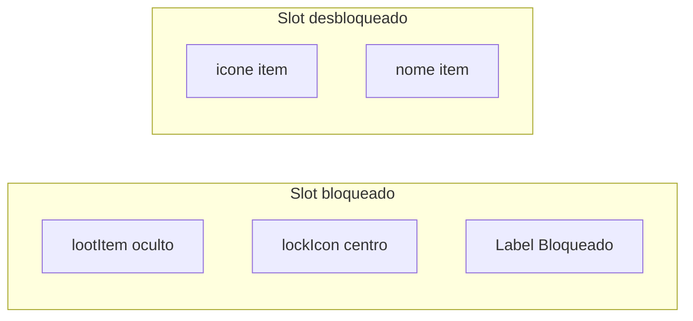

# Melhorar slots de loot bloqueados (Bestiary)

## Problema atual

Em [`bestiary.otui`](c:\8.6\otserv_860\otc-server\client\modules\game_bestiary\bestiary.otui), o `lockHint` usa:

- Cor `#cc6666ff` (vermelho apagado) sobre fundo `#101010`
- Texto longo: *"Mate 1 para desbloquear"* com `text-wrap`
- Ancorado no **rodapé** do slot — o texto sobe e **sobrepõe** o ícone semi-transparente (`opacity 0.35`)

Resultado: ilegível (screenshot Pirate Buccaneer).

## Solução escolhida (opção do usuário)

**Esconder preview do item** quando bloqueado; mostrar só **cadeado centralizado** + label **"Bloqueado"** legível.

Estado desbloqueado (Rat) permanece igual: ícone + nome do item.



---

## Alterações

### 1. OTUI — [`bestiary.otui`](c:\8.6\otserv_860\otc-server\client\modules\game_bestiary\bestiary.otui)

Reestruturar `BestiaryLootSlot`:

| Widget | Mudança |
|--------|---------|
| `lootItem` | Mantém topo; fica **invisível** quando locked (via Lua) |
| `lockIcon` | Aumentar para **16×16**; ancorar **centro** do slot (área do ícone), não canto |
| `lockHint` | Renomear texto para **`Bloqueado`**; cor **`#ffdd88ff`** (dourado claro); fonte `verdana-11px-rounded`; ancorar **abaixo** da área do ícone (`anchors.top: lootItem.bottom`), igual `lootItemName` |
| (opcional) `lockHintBg` | `FlatPanel` fino atrás do label (`#000000aa`, height ~14) para contraste extra |

Remover overlap: `lockHint` **não** usa mais `anchors.bottom: parent.bottom`.

### 2. Lua — [`bestiary.lua`](c:\8.6\otserv_860\otc-server\client\modules\game_bestiary\bestiary.lua) — `applyLootSlot()`

Quando `locked == true`:

```lua
itemWidget:setVisible(false)
itemWidget:setItem(nil)   -- nao renderizar preview
lockIcon:setVisible(true)
lockHint:setVisible(true)
lockHint:setText(tr('Bloqueado'))
nameLabel:setVisible(false)
slot:setTooltip(tr('Mate 1 criatura para desbloquear o saque.'))
```

Quando `locked == false`:

```lua
itemWidget:setVisible(true)
-- applyItemIcon + lootItemName (como hoje)
lockIcon:setVisible(false)
lockHint:setVisible(false)
```

Slot vazio bloqueado (`drop == nil`): mesma aparência locked (cadeado + "Bloqueado").

### 3. Documentação (1 linha)

[`client/docs/BESTIARY-MODULE.md`](c:\8.6\otserv_860\otc-server\client\docs\BESTIARY-MODULE.md) — seção painel detalhes / saque: bloqueado = cadeado + "Bloqueado"; tooltip com instrução completa.

---

## Teste manual

1. Criatura **0 kills** (ex. Pirate Buccaneer): slots SAQUE mostram **cadeado + "Bloqueado"** — texto legível, **sem** ícone fantasma atrás
2. Hover: tooltip *"Mate 1 criatura para desbloquear o saque."*
3. Após **1 kill**: Rat — ícones + nomes normais (regressão OK)

---

## Arquivos

| Arquivo | Escopo |
|---------|--------|
| [`bestiary.otui`](c:\8.6\otserv_860\otc-server\client\modules\game_bestiary\bestiary.otui) | Layout lockIcon + lockHint |
| [`bestiary.lua`](c:\8.6\otserv_860\otc-server\client\modules\game_bestiary\bestiary.lua) | `applyLootSlot` locked/unlocked |
| [`BESTIARY-MODULE.md`](c:\8.6\otserv_860\otc-server\client\docs\BESTIARY-MODULE.md) | Nota UX bloqueado |

Sem alteração no servidor.
