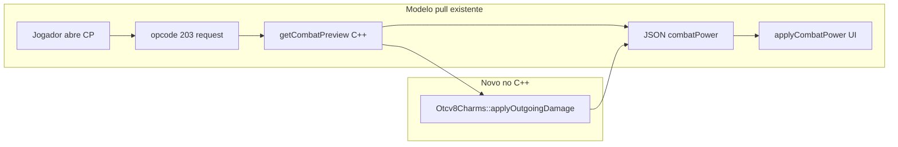

# Charms no Combat Power — preview preciso

## Resposta direta: pesa no servidor ou cliente?

**Não.** Nenhuma das opções adiciona carga contínua.

| Camada | Hoje | Com esta mudança |
|--------|------|------------------|
| **Servidor** | `getCombatPreview()` só quando o cliente pede (login + debounce 450 ms em troca de equip/skill) | Mesma frequência; +9 leituras de storage (`getStorageValue`) por pedido — custo trivial |
| **Cliente** | Modal Combat Power atualiza labels ao abrir | +1 linha de texto ("Charm: +5% Magia Gelo"); sem loop extra |
| **Rede** | Opcode 203, JSON ~2–10 KB | +~30–80 bytes (`charmBonusPercent`, `charmLabel`) no mesmo pacote |

O Bestiary **já envia** níveis de charms no login (`sync.charms`) e na aba Charms (`charms_state`). Esta feature **não** cria novo opcode nem sync em background.



---

## Estado atual (gap)

- **Combate real:** [`otcv8charms.cpp`](c:\8.6\otserv_860\otc-server\server\src\otcv8charms.cpp) em [`weapons.cpp`](c:\8.6\otserv_860\otc-server\server\src\weapons.cpp) e [`combat.cpp`](c:\8.6\otserv_860\otc-server\server\src\combat.cpp) — funciona.
- **Combat Power:** [`combatpreview.cpp`](c:\8.6\otserv_860\otc-server\server\src\combatpreview.cpp) + [`luaPlayerGetCombatPreview`](c:\8.6\otserv_860\otc-server\server\src\luascript.cpp) — **não** aplica charms; preview mostra dano base.
- **Cliente:** [`combatpower.lua`](c:\8.6\otserv_860\otc-server\client\modules\game_combatpower\combatpower.lua) só renderiza o JSON recebido.

---

## Implementação (opção escolhida: min/max exatos)

### 1. C++ — reutilizar lógica existente

**Arquivo:** [`otcv8charms.h`](c:\8.6\otserv_860\otc-server\server\src\otcv8charms.h) / [`.cpp`](c:\8.6\otserv_860\otc-server\server\src\otcv8charms.cpp)

- Adicionar helper público leve, ex.: `getBonusPercent(player, combatType, isDistance)` — extrai a mesma regra de `applyOutgoingDamage` (distance / melee / elemento mágico) sem duplicar storages.

**Arquivo:** [`weapons.h`](c:\8.6\otserv_860\otc-server\server\src\weapons.h)

- Expor `getCombatType()` público (`return params.combatType`) — necessário para **wand** (ex.: gelo), pois `WeaponWand::getElementType()` retorna `COMBAT_NONE` mas o dano usa `params.combatType` (ver [`weapons.cpp` ~885](c:\8.6\otserv_860\otc-server\server\src\weapons.cpp)).

**Arquivo:** [`combatpreview.cpp`](c:\8.6\otserv_860\otc-server\server\src\combatpreview.cpp)

- Incluir `otcv8charms.h`.
- Em `computeWeaponDamagePreview()` — após `damageModifier`, aplicar `Otcv8Charms::applyOutgoingDamage` em `minDamage`, `maxDamage`, `minVsPlayer`, `minVsMonster`:
  - `WEAPON_DISTANCE` → `isDistance = true`, tipo físico
  - `WEAPON_WAND` → `isDistance = false`, tipo = `weaponTool->getCombatType()`
  - melee (sword/axe/club) → melee
- Em `safeApplyPreviewValues()` — após `getPreviewValues`, aplicar charm nas magias de **ataque** (`COMBAT_HEALING` ignorado), usando `combat->getCombatType()`.

**Arquivo:** [`luascript.cpp`](c:\8.6\otserv_860\otc-server\server\src\luascript.cpp) (`luaPlayerGetCombatPreview`)

- Ramo **punhos** (`fist`): aplicar melee charm em `maxDamage`.
- **Elemento secundário** da arma (`elementMax` via `getElementDamage`): aplicar charm com `weaponTool->getElementType()` se `!= COMBAT_NONE`.
- Preencher campos extras na tabela `attack`:
  - `charmBonusPercent` (int, 0–20)
  - `charmLabel` (string PT, ex. `"Magia Gelo"`, `"Melee"`, `"Distance"`)

Mapeamento label sugerido (espelha trilhas em [`otcv8_bestiary_charms.lua`](c:\8.6\otserv_860\otc-server\server\data\lib\otcv8_bestiary_charms.lua)):

| Contexto preview | Trilha |
|------------------|--------|
| Punho / sword / axe / club | melee |
| bow / crossbow / distance | distance |
| COMBAT_ICEDAMAGE | magic_ice |
| COMBAT_FIREDAMAGE | magic_fire |
| … | … |

### 2. Lua servidor — repassar campos

**Arquivo:** [`otcv8_combatpower.lua`](c:\8.6\otserv_860\otc-server\server\data\lib\otcv8_combatpower.lua)

- Em `buildPlayerCombatPower()`, incluir `charmBonusPercent` e `charmLabel` dentro de `attack` (já vêm do C++).

### 3. Cliente — exibir bônus

**Arquivo:** [`combatpower.otui`](c:\8.6\otserv_860\otc-server\client\modules\game_combatpower\combatpower.otui)

- Nova linha em `attackPanel` (após dano físico ou elemento):

```otui
Panel id: charmRow height: 18 visible: false
  Label !text: tr('Charm:')
  Label id: charmValue
```

- Aumentar `statsSectionPanel` dinamicamente em `applyCombatPower` quando `charmRow` visível (mesmo padrão de `elementRow` / `distanceRow`).

**Arquivo:** [`combatpower.lua`](c:\8.6\otserv_860\otc-server\client\modules\game_combatpower\combatpower.lua)

- Em `applyCombatPower()`: se `attack.charmBonusPercent > 0`, mostrar `+N% Label` (cor dourada `#ffd700`); senão ocultar linha.
- Os valores `damageValue` / `elementValue` / lista de magias passam a refletir o servidor automaticamente (sem cálculo local).

**Refresh após compra de charm (opcional, leve):**

- Em [`bestiary.lua`](c:\8.6\otserv_860\otc-server\client\modules\game_bestiary\bestiary.lua) `handleCharmsBuyResult()`: se `modules.game_combatpower.scheduleRequest` existir, chamar — atualiza CP **só se** o jogador tiver o modal aberto ou na próxima abertura (cache `serverCombatPower`).

### 4. Build e docs

- Recompilar: `cmake --build server/build_win -j8`
- Atualizar brevemente [`server/docs/COMBAT-POWER.md`](c:\8.6\otserv_860\otc-server\server\docs\COMBAT-POWER.md) e [`client/docs/COMBAT-POWER-MODULE.md`](c:\8.6\otserv_860\otc-server\client\docs\COMBAT-POWER-MODULE.md) — charms no preview.

**Comando GM:** não incluído neste escopo (custo zero, mas você pediu preview preciso para o jogador). Pode ser fase futura com `/charms` lendo storages on-demand.

---

## Plano de teste

1. Sorcerer com wand de gelo, **0%** Magia Gelo → abrir Combat Power (Ctrl+Shift+O), anotar min/max de dano e de spell de gelo.
2. Comprar **+1%** Magia Gelo no Bestiary → reabrir/atualizar CP → min/max devem subir ~1%; linha **Charm: +1% Magia Gelo** visível.
3. Knight com espada → bônus **Melee**; Paladin com bow → **Distance**.
4. Comparar 1 hit real em dummy vs preview (tolerância de arredondamento `floor`).

---

## Riscos / notas

- Preview continua **sem alvo** (sem modificadores de resistência do monstro) — charms entram igual ao combate contra alvo neutro.
- Magias com múltiplos elementos no preview seguem o `combatType` do `Combat` linkado — alinhado ao que o TFS já calcula em `getPreviewValues`.
- Wand exige `getCombatType()` público; sem isso, gelo/fogo no preview ficaria errado.
