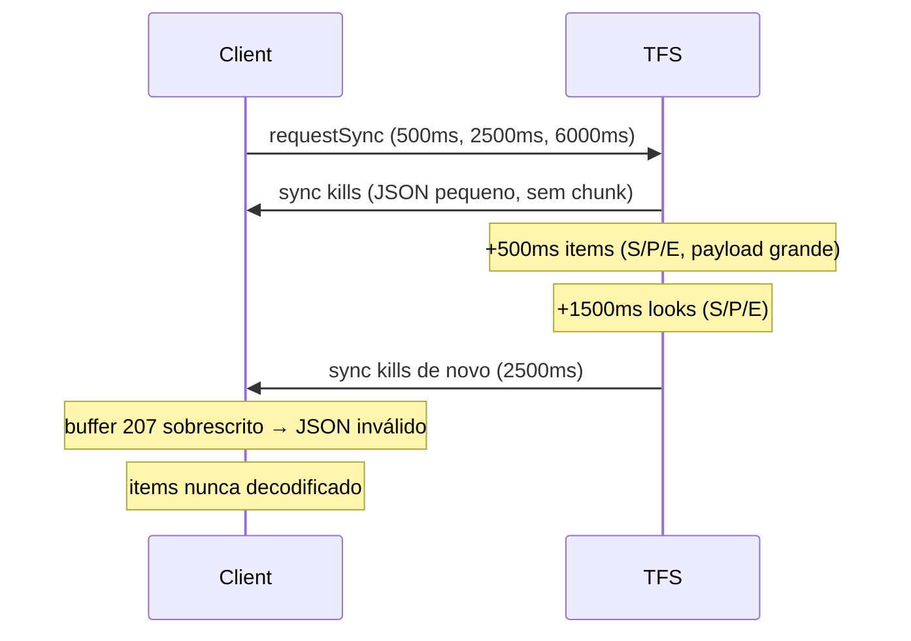

# Corrigir ícones de loot no Bestiary (nome OK, sprite vazio)

## Diagnóstico confirmado

Screenshot + log [`client/otclientv8.log`](c:\8.6\otserv_860\otc-server\client\otclientv8.log):

```
WARNING: [Bestiary] loot item nao resolvido: gold coin ... — aguardando sync 'items'
ERROR: Invalid data in extended JSON opcode (207): trailing garbage / unexpected character
```

**Nunca** aparece `[Bestiary] Mapa de itens sincronizado`.

| O que funciona | Por quê |
|----------------|---------|
| Nome "gold coin" / "cheese" | Fallback em `applyLootSlot`: `drop.name` do JSON quando `resolveDropItem()` retorna `nil` |
| Ícone vazio | `resolveDropItem()` sem `BestiaryItemLookup` → `setItem(nil)` |

### Causa raiz: colisão no opcode 207

O cliente usa **um único buffer** por opcode para montar chunks S/P/E ([`protocolgame.lua`](c:\8.6\otserv_860\otc-server\client\modules\gamelib\protocolgame.lua) L28–34).

`sendFullSync()` dispara em paralelo:



O mapa `items` (~centenas/milhares de entradas) excede `MAX_PACKET_SIZE = 6000` e usa chunking — igual `looks`. Vários `requestSync` do cliente ([`bestiary.lua`](c:\8.6\otserv_860\otc-server\client\modules\game_bestiary\bestiary.lua) L168–170) enviam `sync` no meio do stream e **corrompem** a montagem.

---

## Solução

### 1. Servidor — enviar itens em lotes sem chunking + fila serial

Arquivo: [`server/data/lib/otcv8_bestiary.lua`](c:\8.6\otserv_860\otc-server\server\data\lib\otcv8_bestiary.lua)

- **`sendItemsBatched(player)`** — divide `itemsPayload` em lotes de ~60–80 entradas (~3 KB cada, envelope `{action,data}` < 6000 bytes → **sem** prefixo S/P/E)
- Enviar lotes **em sequência** via `addEvent` (~30 ms entre lotes) numa fila `_syncQueue`
- Último pacote: action `"itemsDone"` (sinaliza fim)
- **`sendFullSync` pipeline** (substituir timers paralelos):

```
sendKills → sendItemsBatched (lotes) → sendLooks
```

- Só marcar `_itemsSent[pid] = true` **após** `itemsDone` enviado com sucesso
- Só iniciar `sendLooks` **depois** que todos os lotes de items terminarem (+ pequeno delay 200 ms)
- Log: `[Otcv8Bestiary] sendItems N lotes, M entradas`

### 2. Cliente — merge incremental + re-render

Arquivo: [`client/modules/game_bestiary/bestiary.lua`](c:\8.6\otserv_860\otc-server\client\modules\game_bestiary\bestiary.lua)

- **`mergeItemsFromServer(data)`** — **mesclar** entradas em `BestiaryItemLookup` (não substituir a tabela inteira a cada lote)
- Novo handler `action == "itemsDone"` → `itemsSynced = true`, log final, `showCreatureDetails(selectedCreature)` se painel aberto
- **`applyLootSlot`** — usar [`Spells.applyItemIcon`](c:\8.6\otserv_860\otc-server\client\modules\gamelib\spells.lua) (padrão Combat Power) em vez de só `setItemId`; fallback `setItem(nil)` se falhar
- Reduzir spam de sync: manter só **1** `scheduleServerSync` no login (ex.: 800 ms) ou ignorar re-sync se `itemsSynced` ainda false

### 3. UI — alinhar UIItem ao Stock/Combat Power

Arquivo: [`client/modules/game_bestiary/bestiary.otui`](c:\8.6\otserv_860\otc-server\client\modules\game_bestiary\bestiary.otui)

- Remover `opacity: 0.35` default do `lootItem` (opacidade controlada só em Lua)
- Adicionar `virtual: true` no `UIItem` (como [`stock.otui`](c:\8.6\otserv_860\otc-server\client\modules\game_stock\stock.otui) L46–47)
- Manter `image-source: /images/ui/item` como fundo do slot (desenho do item fica por cima — [`uiitem.cpp`](c:\8.6\otserv_860\otc-server\client\src\client\uiitem.cpp) L46–56)

### 4. Documentação

Atualizar [`server/docs/BESTIARY-MODULE.md`](c:\8.6\otserv_860\otc-server\server\docs\BESTIARY-MODULE.md) e [`client/docs/BESTIARY-MODULE.md`](c:\8.6\otserv_860\otc-server\client\docs\BESTIARY-MODULE.md):

- Action `items` enviada em **lotes** + `itemsDone`
- Aviso: não enviar múltiplos streams S/P/E simultâneos no mesmo opcode 207
- Pipeline serial: kills → items (lotes) → looks

---

## Teste manual (Rat)

1. Reiniciar servidor + cliente
2. Logar, aguardar ~3–5 s
3. Log cliente **deve** ter:
   - `[Bestiary] Mapa de itens sincronizado: N entradas` (após `itemsDone`)
   - **Sem** `Invalid data in extended JSON opcode (207)` durante sync
4. Bestiary → Rat → SAQUE: moeda + queijo com **ícone e nome**
5. **Sem** warnings `aguardando sync 'items'`

---

## Arquivos

| Arquivo | Mudança |
|---------|---------|
| [`server/data/lib/otcv8_bestiary.lua`](c:\8.6\otserv_860\otc-server\server\data\lib\otcv8_bestiary.lua) | Lotes `items`, fila serial, pipeline antes de `looks` |
| [`client/modules/game_bestiary/bestiary.lua`](c:\8.6\otserv_860\otc-server\client\modules\game_bestiary\bestiary.lua) | Merge lotes, `itemsDone`, `applyItemIcon`, menos sync spam |
| [`client/modules/game_bestiary/bestiary.otui`](c:\8.6\otserv_860\otc-server\client\modules\game_bestiary\bestiary.otui) | UIItem `virtual: true`, sem opacity default |
| Docs BESTIARY-MODULE (cliente + servidor) | Protocolo lotes + fila |
