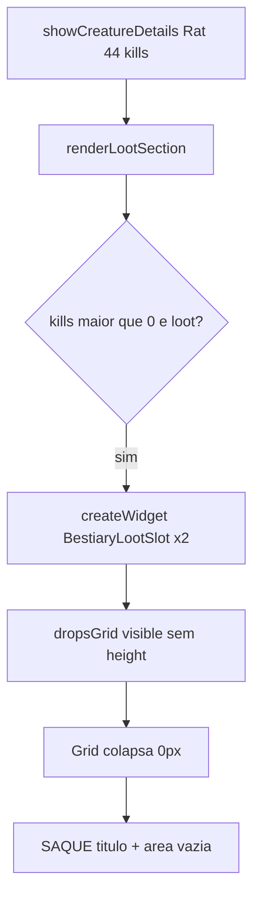
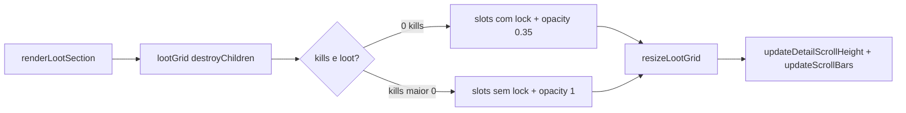

# Corrigir saque invisível no painel de detalhes

## Diagnóstico (confirmado)

### Dados — Rat tem loot e kills suficientes

Em [`bestiary_database.json`](c:\8.6\otserv_860\otc-server\client\modules\game_bestiary\bestiary_database.json):

```json
"loot": [
  { "chance": 100000, "countmax": 4, "name": "gold coin" },
  { "chance": 39410, "countmax": 1, "id": 2696 }
]
```

Com **44 kills**, [`renderLootSection`](c:\8.6\otserv_860\otc-server\client\modules\game_bestiary\bestiary.lua) entra no ramo correto:

```lua
if creature.kills > 0 and creature.loot and #creature.loot > 0 then
  dropsGrid:setVisible(true)
  -- cria 2x BestiaryLootSlot
```

A lógica Lua **não** é o problema principal — o ramo executa e cria widgets.

### Causa raiz — layout OTUI assimétrico

| Widget | Altura | Estado no Rat (44 kills) |
|--------|--------|--------------------------|
| `lootLockedGrid` | `height: 156` fixo | `visible: false` |
| `dropsGrid` | **sem height** | `visible: true`, 2 filhos |

Em [`bestiary.otui`](c:\8.6\otserv_860\otc-server\client\modules\game_bestiary\bestiary.otui) (~L545–576):

- `lootLockedGrid` tem altura explícita → slots bloqueados renderizam
- `dropsGrid` só tem `anchors.top` + `width: 312` + grid layout → **painel colapsa a 0px**; slots existem mas não ocupam espaço

`updateDetailScrollHeight` aumenta `detailScrollContent` (~248px) mas **nunca define altura do `dropsGrid`** → área cinza vazia abaixo de "SAQUE" com scrollbar.



### Causa secundária — IDs de item

[`resolveDropItemId`](c:\8.6\otserv_860\otc-server\client\modules\game_bestiary\bestiary.lua) usa `drop.id` direto como clientId. Documentação em [`BESTIARY-MODULE.md`](c:\8.6\otserv_860\otc-server\client\docs\BESTIARY-MODULE.md) alerta: **2696 pode ser serverId**, não clientId → cheese invisível mesmo após fix de layout. Gold coin funciona via `name`.

### Não é bug (Wrath of the Emperor)

Boss com `"loot": []` → mensagem *"Sem loot registrado"* está correta.

---

## Como identificar erros (checklist)

1. **`client/otclientv8.log`** — procurar `ERROR:` / `protected lua call failed` com `[Bestiary]`
2. **Logs novos** (a adicionar): `[Bestiary] loot: Rat branch=unlocked slots=2 ids=...`
3. **In-game**: se título "SAQUE" aparece mas área vazia → layout (altura 0); se nem título → scroll/visibilidade
4. **JSON**: `#creature.loot` e `creature.kills` no ramo de `renderLootSection`

---

## Correções propostas

### 1. Layout — [`bestiary.otui`](c:\8.6\otserv_860\otc-server\client\modules\game_bestiary\bestiary.otui)

- Unificar loot em **um único container** `lootGrid` (evita dois painéis sobrepostos no mesmo anchor)
- OU manter `dropsGrid` e adicionar altura mínima + cálculo dinâmico
- Remover `phantom: true` do `UIItem` `lootItem` em `BestiaryLootSlot` (padrão do [`10-items.otui`](c:\8.6\otserv_860\otc-server\client\data\styles\10-items.otui) — Item renderiza sem phantom)
- Garantir `image-source: /images/ui/item` no UIItem (slot visual Tibia)

### 2. Lua — [`bestiary.lua`](c:\8.6\otserv_860\otc-server\client\modules\game_bestiary\bestiary.lua)

**Nova função `resizeLootGrid(grid, itemCount)`:**

```lua
local cols, cellH, spacing = 3, 72, 6
local rows = math.max(1, math.ceil(itemCount / cols))
grid:setHeight(rows * cellH + math.max(0, rows - 1) * spacing)
```

Chamar após popular slots (locked e unlocked).

**Refatorar `updateDetailScrollHeight`:**

- Calcular altura a partir do **bottom real** do widget de loot (`getY() + getHeight()`) ou soma das seções
- Após resize, chamar `scrollArea:updateScrollBars()` (via `detailScrollArea` UIScrollArea)

**`resolveDropItemId` — priorizar name, fallback serverId:**

```lua
-- 1) name → g_things.findItemTypeByName
-- 2) id → tentar setItemId; se inválido, g_things.getItemType(id) ou ItemType(id):getClientId()
-- 3) fallback 3392 + g_logger.warning com nome do drop
```

Para 8.60 OTC: usar `g_things.getItemType(serverId)` se disponível, senão tabela conhecida ou só `name` no JSON.

**Logs de diagnóstico** (nível info/warning):

```lua
g_logger.info(string.format("[Bestiary] loot: %s branch=%s slots=%d kills=%d",
  creature.name, branch, count, creature.kills))
```

### 3. Simplificar `renderLootSection`

- Um grid (`lootGrid`) para locked e unlocked
- Locked: reutilizar slots OTUI ou criar dinamicamente (como unlocked)
- Evitar `destroyChildren` no grid errado ao trocar de criatura

Fluxo alvo:



---

## Teste manual

1. Reiniciar `otclient_gl.exe`
2. **Rat** (44 kills) → 2 ícones: gold coin + cheese abaixo de "SAQUE"
3. **Rotworm** (0 kills, com loot) → grid bloqueado com cadeado
4. Matar 1 rotworm → ícones desbloqueados
5. **Wrath of the Emperor** → mensagem "Sem loot registrado"
6. Log: `[Bestiary] loot: Rat branch=unlocked slots=2` sem ERROR

---

## Arquivos alterados

| Arquivo | Mudança |
|---------|---------|
| [`bestiary.otui`](c:\8.6\otserv_860\otc-server\client\modules\game_bestiary\bestiary.otui) | Unificar `lootGrid`, altura, UIItem sem phantom |
| [`bestiary.lua`](c:\8.6\otserv_860\otc-server\client\modules\game_bestiary\bestiary.lua) | `resizeLootGrid`, `resolveDropItemId`, logs, scroll refresh |

Sem alteração no servidor ou JSON nesta entrega (IDs via `name` já resolvem cheese se lookup funcionar; `id` como fallback melhorado).
