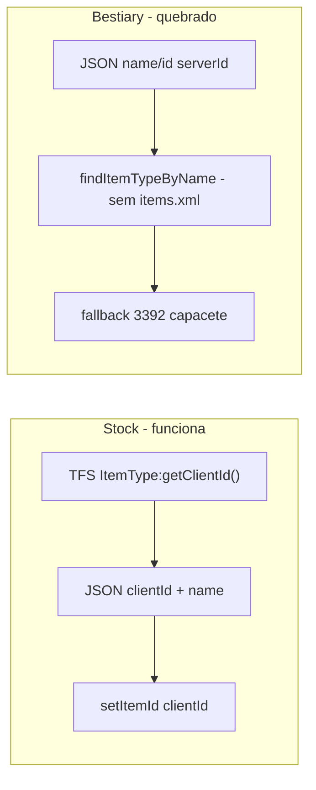

# Corrigir loot do Bestiary (ícone + nome) — padrão Stock

## Diagnóstico

### Por que Stock/Inventário funcionam

| Sistema | Origem do clientId | Como renderiza |
|---------|-------------------|----------------|
| **Stock** | Servidor: `ItemType(itemId):getClientId()` em [`otcv8_stock.lua`](c:\8.6\otserv_860\otc-server\server\data\lib\otcv8_stock.lua) → JSON opcode 205 | `itemWidget:setItemId(entry.clientId)` |
| **Inventário** | Protocolo de jogo (servidor envia `Item` completo) | `itemWidget:setItem(item)` |
| **Bestiary (hoje)** | JSON estático + `findItemTypeByName` / scan local | `setItemId(resolveDropItemId(...))` → **falha** |

### Por que o Bestiary falha (mesmo após o fix anterior)

[`things.lua`](c:\8.6\otserv_860\otc-server\client\modules\game_things\things.lua) carrega **apenas** `Tibia.dat` + `Tibia.spr`. **Nunca** chama `g_things.loadOtb()` nem `loadXml()`.

Sem OTB/XML:
- `findItemTypeByName("gold coin")` → vazio (`m_itemTypes` não populado)
- `resolveClientIdFromServerId(2696)` → scan via `findItemTypeByClientId().getServerId()` também vazio (`m_reverseItemTypes` é OTB-only)
- Log atual confirma: `loot item nao resolvido: gold coin`, `loot id 2696 nao mapeado`
- Fallback [`LOOT_FALLBACK_ITEM_ID = 3392`](c:\8.6\otserv_860\otc-server\client\modules\game_bestiary\bestiary.lua) → ícone de capacete (screenshot)

### Por que o nome não aparece

[`BestiaryLootSlot`](c:\8.6\otserv_860\otc-server\client\modules\game_bestiary\bestiary.otui) só tem `UIItem` + `lockHint`. Quando desbloqueado, `lockHint` fica oculto — **não há Label de nome**; só tooltip.



---

## Solução proposta (padrão Stock)

### 1. Servidor — mapa de itens no opcode 207

Arquivo: [`server/data/lib/otcv8_bestiary.lua`](c:\8.6\otserv_860\otc-server\server\data\lib\otcv8_bestiary.lua)

- Nova função `buildItemLookup()` no boot (junto ao cache de looks):
  - Iterar `BestiaryMonsterNames`
  - Para cada monstro: `MonsterType(name):getLoot()`
  - Coletar `itemId` únicos (serverId)
  - Para cada id: `{ clientId = ItemType(id):getClientId(), name = ItemType(id):getName() }`
- Nova action JSON `"items"` enviada **1× por sessão** em `sendFullSync()` (após kills, antes/depois de looks — pacote pequeno, só itens usados no bestiary)
- Payload compacto:

```lua
-- data = { ["2148"] = { c = 3031, n = "gold coin" }, ["2696"] = { c = 3607, n = "cheese" }, ... }
```

- Documentar em [`server/docs/BESTIARY-MODULE.md`](c:\8.6\otserv_860\otc-server\server\docs\BESTIARY-MODULE.md)

### 2. Cliente — consumir lookup e renderizar como Stock

Arquivo: [`client/modules/game_bestiary/bestiary.lua`](c:\8.6\otserv_860\otc-server\client\modules\game_bestiary\bestiary.lua)

- Cache `BestiaryItemLookup = {}` preenchido em `onExtendedJSONOpcode` quando `action == "items"`
- Substituir `resolveDropItemId()` por `resolveDropItem(drop)` retornando `{ clientId, name }`:

```lua
-- ordem de resolução:
-- 1) drop.clientId (futuro JSON export)
-- 2) BestiaryItemLookup[tostring(drop.id)]
-- 3) BestiaryItemLookup por drop.name (scan leve no lookup)
-- 4) sem fallback silencioso para 3392 — log warning + slot vazio ou ícone genérico
```

- Em `applyLootSlot()`:
  - Usar `Spells.applyItemIcon(itemWidget, clientId, 1)` **ou** `setItemId(clientId)` (mesmo padrão Stock)
  - Preencher label de nome (ver passo 3)
  - Tooltip: `"Nome (Chance: X%)"` com nome resolvido

- Handler `action == "items"`: se bestiary aberto, re-renderizar detalhes do monstro selecionado

### 3. UI — Label com nome do item

Arquivo: [`client/modules/game_bestiary/bestiary.otui`](c:\8.6\otserv_860\otc-server\client\modules\game_bestiary\bestiary.otui)

- Adicionar `Label id: lootItemName` abaixo do ícone (fonte `verdana-11px-rounded`, cor `#cccccc`, `text-align: center`, `text-wrap: true`)
- Ajustar `LOOT_GRID_CELL_H` se necessário (~72 → ~84 px)
- Comportamento:
  - **Desbloqueado:** mostrar `lootItemName`, esconder `lockHint`
  - **Bloqueado:** esconder `lootItemName`, mostrar `lockHint`

### 4. Documentação

Arquivo: [`client/docs/BESTIARY-MODULE.md`](c:\8.6\otserv_860\otc-server\client\docs\BESTIARY-MODULE.md)

- Corrigir seção loot: **cliente não resolve serverId localmente** sem OTB/XML
- Documentar action `"items"` do opcode 207 e campos `c`/`n`
- Referência cruzada com padrão Stock (`COMBAT-POWER-MODULE.md` / `STOCK-MODULE.md`)

---

## O que NÃO fazer nesta entrega

- **Não** depender de `findItemTypeByName` / loop `100..35000` como caminho principal — continua quebrado sem OTB
- **Não** carregar OTB/items.xml no cliente agora (não há `.otb` no repo; seria setup manual extra)
- **Não** re-exportar manualmente os ~1337 monstros do JSON como única solução (útil como fallback futuro, mas não resolve gold coin sem `id`)

---

## Teste manual (Rat)

1. Reiniciar **servidor** e **cliente** (logado)
2. Aguardar sync opcode 207 (`items` + kills)
3. Bestiary → **Rat** (kills > 0)
4. SAQUE deve mostrar:
   - Ícone de **gold coin** + label "gold coin"
   - Ícone de **cheese** + label "cheese"
5. Log **sem** warnings `loot item nao resolvido` / `loot id 2696 nao mapeado`
6. Criatura bloqueada (0 kills): slots cinza + "Mate 1 para desbloquear", sem nomes visíveis

---

## Arquivos a alterar

| Arquivo | Mudança |
|---------|---------|
| [`server/data/lib/otcv8_bestiary.lua`](c:\8.6\otserv_860\otc-server\server\data\lib\otcv8_bestiary.lua) | `buildItemLookup()`, enviar action `"items"` |
| [`client/modules/game_bestiary/bestiary.lua`](c:\8.6\otserv_860\otc-server\client\modules\game_bestiary\bestiary.lua) | Cache lookup, `resolveDropItem`, `applyLootSlot` |
| [`client/modules/game_bestiary/bestiary.otui`](c:\8.6\otserv_860\otc-server\client\modules\game_bestiary\bestiary.otui) | Label `lootItemName` |
| [`client/docs/BESTIARY-MODULE.md`](c:\8.6\otserv_860\otc-server\client\docs\BESTIARY-MODULE.md) | Fluxo serverId→clientId via servidor |
| [`server/docs/BESTIARY-MODULE.md`](c:\8.6\otserv_860\otc-server\server\docs\BESTIARY-MODULE.md) | Protocolo action `"items"` |
