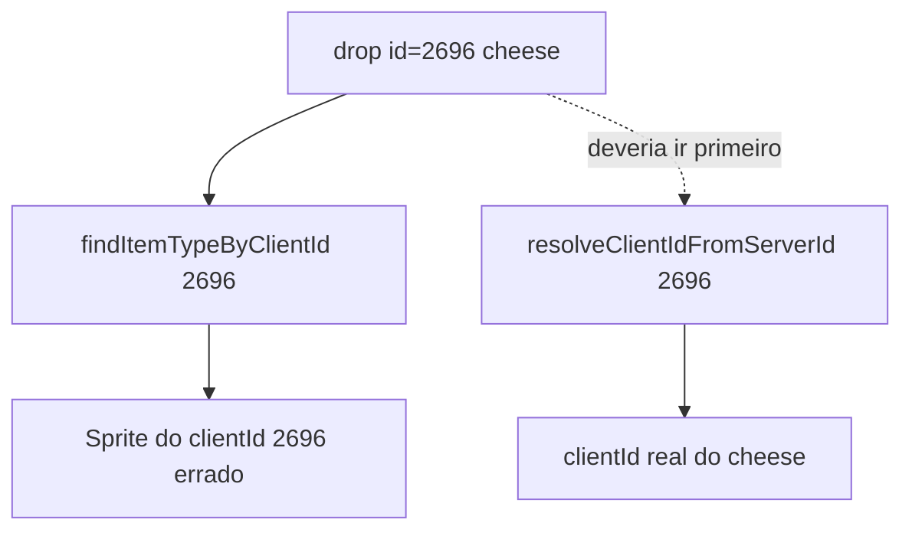

# Corrigir ícones de loot no Bestiary

## Por que aparece ícone errado

No TFS existem **dois IDs** para o mesmo item:

| Conceito | Onde | Exemplo Rat |
|----------|------|-------------|
| **serverId** | [`items.xml`](c:\8.6\otserv_860\otc-server\server\data\items\items.xml) / loot do monstro | gold coin `2148`, cheese **`2696`** |
| **clientId** | `Tibia.dat` / `UIItem:setItemId()` | gold coin ~`3031`, cheese ~`3607` (varia por DAT) |

O [`rat.xml`](c:\8.6\otserv_860\otc-server\server\data\monster\Glires\rat.xml) confirma:

```xml
<item name="gold coin" countmax="4" chance="100000"/>
<item id="2696" chance="39410"/><!-- cheese -->
```

O JSON espelha isso em [`bestiary_database.json`](c:\8.6\otserv_860\otc-server\client\modules\game_bestiary\bestiary_database.json): gold coin com `name`, cheese só com `id: 2696`.

### Bug no cliente

Em [`bestiary.lua`](c:\8.6\otserv_860\otc-server\client\modules\game_bestiary\bestiary.lua) (~L431–435):

```lua
local itemType = g_things.findItemTypeByClientId(drop.id)
if itemType and itemType:getClientId() > 0 then
  return itemType:getClientId()  -- ERRADO: 2696 vira clientId 2696
end
```

`2696` no JSON é **serverId do cheese**, mas o código interpreta como **clientId** → sprite de outro item (capacete/sangue na screenshot).

`resolveClientIdFromServerId()` existe mas só roda **depois** desse early return errado.



---

## Como pegar o ID correto (referência)

### Para o JSON / export (recomendado)

| Campo JSON | Origem | Uso no cliente |
|------------|--------|----------------|
| **`name`** | `items.xml` → `name="cheese"` | `g_things.findItemTypeByName("cheese")` → clientId correto |
| **`id`** | serverId do TFS | Só após mapear com `getServerId()` no DAT |

**Regra:** preferir sempre `"name": "cheese"` no JSON (como gold coin). O `id` sozinho exige conversão serverId→clientId.

### Consultar IDs manualmente

1. **serverId:** [`server/data/items/items.xml`](c:\8.6\otserv_860\otc-server\server\data\items\items.xml) — ex. `id="2696" name="cheese"`
2. **clientId no OTC (runtime):** após fix, log `[Bestiary] loot item: cheese serverId=2696 clientId=XXXX`
3. **In-game debug (terminal Lua OTC):** `g_things.findItemTypeByName("cheese"):getClientId()`
4. **Validar mapeamento:** `g_things.findItemTypeByClientId(X):getServerId()` deve bater com o serverId esperado

Doc alinhada: [`COMBAT-POWER-MODULE.md`](c:\8.6\otserv_860\otc-server\client\docs\COMBAT-POWER-MODULE.md) — *"servidor envia clientId; usar serverId direto no cliente mostra sprite errado"*.

---

## Correções propostas

### 1. Corrigir `resolveDropItemId` — [`bestiary.lua`](c:\8.6\otserv_860\otc-server\client\modules\game_bestiary\bestiary.lua)

Nova ordem:

1. `drop.name` → `findItemTypeByName` → `getClientId()`
2. `drop.id` → **`resolveClientIdFromServerId(drop.id)`** (tratar como serverId)
3. Só então: `findItemTypeByClientId(drop.id)` **se** `itemType:getServerId() == drop.id` (id já é clientId válido)
4. Fallback `LOOT_FALLBACK_ITEM_ID` + `g_logger.warning`

Remover o bloco que retorna cegamente `findItemTypeByClientId(drop.id)` sem checar `getServerId()`.

Log de diagnóstico (info):

```lua
"[Bestiary] loot item: %s serverId=%s clientId=%d"
```

### 2. Enriquecer JSON do Rat (mínimo)

Em [`bestiary_database.json`](c:\8.6\otserv_860\otc-server\client\modules\game_bestiary\bestiary_database.json), entrada cheese:

```json
{ "chance": 39410, "countmax": 1, "name": "cheese", "id": 2696 }
```

`name` garante ícone mesmo se o scan serverId falhar (ex. DAT corrompido — log atual: `Failed to read dat ... corrupt data id: 440`).

### 3. Otimizar scan (opcional nesta entrega)

O loop `100..35000` em `resolveClientIdFromServerId` é lento na 1ª vez. Após fix de ordem + `name` no JSON, impacto mínimo. Futuro: cache global no `init()` se necessário.

### 4. Atualizar doc — [`BESTIARY-MODULE.md`](c:\8.6\otserv_860\otc-server\client\docs\BESTIARY-MODULE.md)

Corrigir linha que diz `id (clientId)` → **`id (serverId TFS)`**; recomendar `name` no loot.

---

## Teste manual

1. Reiniciar cliente
2. Bestiary → **Rat** (kills > 0)
3. SAQUE: **gold coin** (moedas) + **cheese** (queijo) — não capacete/sangue
4. Log: `[Bestiary] loot item: cheese serverId=2696 clientId=...` sem warning de id não mapeado
5. **Rotworm** locked: ícones cinza corretos nos slots bloqueados

---

## Arquivos

| Arquivo | Mudança |
|---------|---------|
| [`bestiary.lua`](c:\8.6\otserv_860\otc-server\client\modules\game_bestiary\bestiary.lua) | Ordem correta em `resolveDropItemId` + log clientId resolvido |
| [`bestiary_database.json`](c:\8.6\otserv_860\otc-server\client\modules\game_bestiary\bestiary_database.json) | Rat cheese: adicionar `"name": "cheese"` |
| [`BESTIARY-MODULE.md`](c:\8.6\otserv_860\otc-server\client\docs\BESTIARY-MODULE.md) | Documentar serverId vs clientId no loot |

Não alterar servidor nesta entrega — conversão é 100% client-side.
