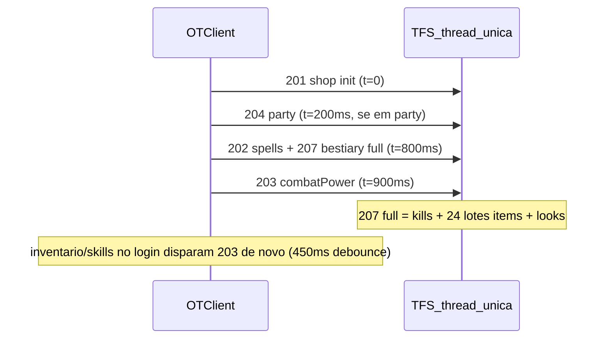

# Plano: otimização de carga no login em massa

## Diagnóstico (estado atual)

Com **1 jogador**, o log já mostra dezenas de `getCombatPreview` e cada pacote extended passa por **7 handlers Lua** em loop no C++:

```4801:4809:c:\8.6\otserv_860\otc-server\server\src\game.cpp
	for (CreatureEvent* creatureEvent : player->getCreatureEvents(CREATURE_EVENT_EXTENDED_OPCODE)) {
		creatureEvent->executeExtendedOpcode(player, opcode, buffer);
	}
```

No login, o cliente dispara automaticamente ~4 opcodes no primeiro segundo:



**Gargalos confirmados (ordenados por impacto):**

| # | Gargalo | Escala com 1000 logins |
|---|---------|------------------------|
| 1 | Bestiary `requestSync` → 1635 itens em 24 lotes + looks | Muito alto (rede + CPU + fila Lua) |
| 2 | `getCombatPreview` repetido no login (inventário/skills) | Alto (C++ + callbacks Lua por magia) |
| 3 | 7 crossings C++→Lua por pacote extended | Médio-alto (6 desperdiçados) |
| 4 | `sendKills` varre ~1400 nomes mesmo com 4 kills | Médio |
| 5 | Logs diagnósticos (`[extopcode]`, `[combatpreview]`) | Médio se `enableTfsDiagnosticLog=true` |

`maxPlayers = 2000` em [`server/config.lua`](c:\8.6\otserv_860\otc-server\server\config.lua) não protege contra sobrecarga de CPU — só o limite configurado.

---

## Fase 0 — Baseline (antes de mudar código)

Objetivo: ter números para comparar.

1. **Login de 1 player** — anotar no console:
   - quantidade de linhas `[extopcode] opcode=203`
   - quantidade de `[combatpreview] ... done`
   - tempo até `[login] ready for game packets`
   - `[Otcv8Bestiary] sendItems` (deve sumir após lazy sync)

2. **Opcional stress** — 10–20 logins rápidos (contas de teste) e observar CPU do `tfs.exe` + lag perceptível.

3. Manter [`enableTfsDiagnosticLog = false`](c:\8.6\otserv_860\otc-server\server\config.lua) em produção (já está `false`; só ligar temporariamente para medir).

---

## Fase 1 — Roteamento de extended opcode (C++, rebuild)

**Arquivo:** [`server/src/game.cpp`](c:\8.6\otserv_860\otc-server\server\src\game.cpp) — `parsePlayerExtendedOpcode`

Substituir o loop broadcast por roteamento direto:

```cpp
// opcode → nome do creature event (convenção já usada no login.lua)
case 201: "ExtendedOpcodeShop"
case 202: "ExtendedOpcodeSpellList"
case 203: "ExtendedOpcodeCombatPower"
// ... 204–207
```

- Buscar **um** handler pelo nome na lista filtrada e executar só ele.
- Opcodes desconhecidos: ignorar silenciosamente (comportamento equivalente ao atual, onde todos retornam `false`).

**Extra:** remover registro morto `registerCreatureEvent("ExtendedOpcode")` em [`server/src/protocolgame.cpp`](c:\8.6\otserv_860\otc-server\server\src\protocolgame.cpp) (~linha 164) — evento não existe no XML.

**Ganho esperado:** ~**85% menos crossings Lua** por pacote (7 → 1). Sem mudança de protocolo.

**Rebuild:** MinGW → copiar `tfs.exe` conforme [`server/docs/BUILD.md`](c:\8.6\otserv_860\otc-server\server\docs\BUILD.md).

---

## Fase 2 — Bestiary lazy sync (maior ganho no login)

Escolha confirmada: **só kills no login**; looks + itens ao abrir a UI.

### Servidor

**Arquivos:**
- [`server/data/lib/otcv8_bestiary.lua`](c:\8.6\otserv_860\otc-server\server\data\lib\otcv8_bestiary.lua)
- [`server/data/creaturescripts/scripts/otcv8_bestiary.lua`](c:\8.6\otserv_860\otc-server\server\data\creaturescripts\scripts\otcv8_bestiary.lua)

Mudanças:
1. Nova action `requestKills` → chama só `Otcv8Bestiary.sendKills(player)` (1 pacote `sync`, sem pipeline de items/looks).
2. `requestSync` mantém `sendFullSync` → usado ao abrir bestiary.
3. Reutilizar `canRequestSync` para ambas (debounce 1 s já existe).
4. Opcional nesta fase: `sendKills` com debounce próprio mais curto (0.5 s) para não bloquear `requestSync` logo após login.

### Cliente

**Arquivo:** [`client/modules/game_bestiary/bestiary.lua`](c:\8.6\otserv_860\otc-server\client\modules\game_bestiary\bestiary.lua)

Mudanças:
1. `onGameStart` → `requestKills` (não `requestSync`), delay ~1500 ms (espalhar pico).
2. `toggle()` / `show()` → `requestSync` se `not looksSynced or not itemsSynced`.
3. Comentário existente (linha 145) vira loading state simples ao abrir bestiary pela primeira vez.

**Kill toasts:** continuam via action `sync` (kills) + `update` em tempo real — sem depender de items/looks.

**Ganho esperado:** elimina **24 lotes × N jogadores** no login; reduz tráfego servidor→cliente em ~95% por login.

---

## Fase 3 — Combat Power: parar rajada no login

### Servidor (padrão Bestiary)

**Arquivos:**
- [`server/data/lib/otcv8_combatpower.lua`](c:\8.6\otserv_860\otc-server\server\data\lib\otcv8_combatpower.lua)
- [`server/data/creaturescripts/scripts/otcv8_combatpower.lua`](c:\8.6\otserv_860\otc-server\server\data\creaturescripts\scripts\otcv8_combatpower.lua)

Adicionar:
- `_lastCombatPowerRequest[pid]` + `COMBAT_POWER_DEBOUNCE_SEC = 1.0`
- `_combatPowerPending[pid]` opcional para coalescer requests durante cálculo

Espelhar `Otcv8Bestiary.canRequestSync` (~linhas 443–458 de `otcv8_bestiary.lua`).

### Cliente

**Arquivo:** [`client/modules/game_combatpower/combatpower.lua`](c:\8.6\otserv_860\otc-server\client\modules\game_combatpower\combatpower.lua)

Mudanças:
1. **Período de settling no login** (~3 s): `onPlayerStateChange` ignora eventos de inventário/skill/container logo após `onGameStart` (causa principal das dezenas de opcode 203 no log).
2. `onGameStart` usa `scheduleRequest()` (450 ms) em vez de request direto aos 900 ms — unifica debounce.
3. Aumentar debounce de 450 → **600 ms** (ajuste fino após teste).

**Ganho esperado:** de ~20+ `getCombatPreview`/login para **1–2**.

---

## Fase 4 — Micro-otimizações C++ no getCombatPreview (rebuild)

**Arquivo:** [`server/src/combatpreview.cpp`](c:\8.6\otserv_860\otc-server\server\src\combatpreview.cpp)

Mudanças de baixo risco:

1. **Skip preview em magias não-usáveis** — em `pushSpellPreviews`, só chamar `safeApplyPreviewValues` se status for `ok` ou `soon` (magias `locked`/`mana`/`weapon` não precisam de min/max na UI).
2. **Unificar loop de runas** — uma passagem em `getRunes()` preenchendo healing + attack (hoje são 2 loops completos).

Não incluir nesta fase (risco médio/alto): cache cross-request de spells, índice vocação→spells no boot.

**Ganho esperado:** ~30–50% menos CPU por request 203 que ainda chegar.

---

## Fase 5 — Espalhar opcodes no login (cliente)

Ajustar delays para não concentrar tudo em t=800–900 ms:

| Módulo | Opcode | Delay sugerido |
|--------|--------|----------------|
| shop | 201 | 0 ms (leve) |
| actionbar | 202 | 1200 ms |
| bestiary kills | 207 `requestKills` | 1800 ms |
| combatpower | 203 | 2400 ms |
| party | 204 | 600 ms (só se em party) |

Arquivos: [`combatpower.lua`](c:\8.6\otserv_860\otc-server\client\modules\game_combatpower\combatpower.lua), [`bestiary.lua`](c:\8.6\otserv_860\otc-server\client\modules\game_bestiary\bestiary.lua), [`actionbar.lua`](c:\8.6\otserv_860\otc-server\client\modules\game_actionbar\actionbar.lua), [`party.lua`](c:\8.6\otserv_860\otc-server\client\modules\game_party\party.lua).

**Nota:** com 1000 logins simultâneos o espacamento por cliente ajuda pouco sozinho; o valor real vem das fases 1–4. Ainda assim reduz micro-picos no thread único.

---

## Fase 6 — Validação pós-implementação

Checklist por login (1 player):

- [ ] 0× `sendItems` no login (só ao abrir bestiary)
- [ ] 1× `sendKills` no login
- [ ] ≤2× `getCombatPreview` no login
- [ ] 1 handler Lua por pacote extended (sem 6 logs extras se diagnóstico ligado)
- [ ] Bestiary abre e carrega looks+itens corretamente
- [ ] Combat Power modal e botão topbar OK após equipar item
- [ ] Kill toast no mapa após abate

Stress opcional: 20 logins → CPU estável, sem timeout.

---

## Expectativa realista para 1000 simultâneos

| Cenário | Antes (estimado) | Depois (estimado) |
|---------|------------------|-------------------|
| Pacotes extended/login | ~4 × 7 handlers + rajada 203 + 24 lotes bestiary | ~4 × 1 handler + 1–2 previews + 1 kill sync |
| Travamento total | Improvável crash; lag severo provável | Lag reduzido; ainda depende de CPU/RAM/DB |
| Limite prático | Centenas sem tuning | Centenas–1000 mais viável com hardware adequado |

**1000 no mesmo segundo** nunca será “grátis” em TFS single-thread — este plano **melhora muito** o custo por login, mas produção ainda precisa de VPS dimensionada + MariaDB tunado + possível fila de espera (`waitlist`).

---

## Ordem de implementação recomendada

1. Fase 1 (C++ routing) — ganho transversal, baixo risco
2. Fase 2 (bestiary lazy) — maior impacto no login
3. Fase 3 (combat power debounce) — elimina rajada visível no log
4. Fase 4 (C++ combatpreview) — rebuild junto com Fase 1 se possível
5. Fase 5 (delays cliente) — polish
6. Fase 6 (validação)

## Arquivos tocados (resumo)

**Servidor C++:** `game.cpp`, `protocolgame.cpp`, `combatpreview.cpp`  
**Servidor Lua:** `otcv8_bestiary.lua`, `otcv8_bestiary.lua` (creaturescript), `otcv8_combatpower.lua`, `otcv8_combatpower.lua` (creaturescript)  
**Cliente:** `bestiary.lua`, `combatpower.lua`, `actionbar.lua`, `party.lua`
