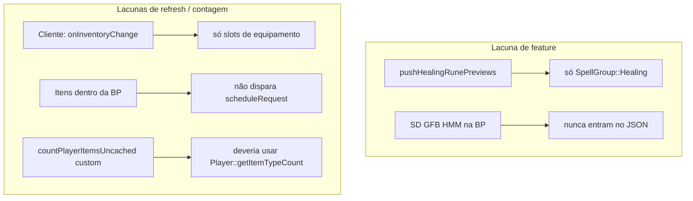

# Runas na BP — Combat Power

## Diagnóstico

O modal mostra **"Sem runas de cura no inventario"** mesmo com runas na mochila por **dois motivos combinados**:



| Problema | Evidência no código |
|----------|---------------------|
| Runas de **ataque** ausentes | Doc em [`server/docs/COMBAT-POWER.md`](c:\8.6\otserv_860\otc-server\server\docs\COMBAT-POWER.md) linha 217: *"hoje healingRunes só grupo healing"* |
| Só runas de cura no JSON | [`pushHealingRunePreviews`](c:\8.6\otserv_860\otc-server\server\src\combatpreview.cpp) filtra `getGroup() != Healing` |
| BP não atualiza CP sozinha | [`combatpower.lua`](c:\8.6\otserv_860\otc-server\client\modules\game_combatpower\combatpower.lua) conecta `LocalPlayer.onInventoryChange`, mas **não** `Container.onUpdateItem` |
| Contagem duplicada | `ItemCountCache` reimplementa varredura; TFS já expõe [`Player::getItemTypeCount`](c:\8.6\otserv_860\otc-server\server\src\player.cpp) com `ContainerIterator` recursivo |

**Nota:** runas de cura (IHR `2265`, UHR `2273`) e ataque (SD `2268`) estão em [`spells.xml`](c:\8.6\otserv_860\otc-server\server\data\spells\spells.xml). O preview de dano/cura via `safeApplyPreviewValues` + `getPreviewValues` já funciona (charms incluídos para ataque).

---

## Implementação

### 1. Servidor C++ — contagem + runas de ataque

**Arquivo:** [`server/src/combatpreview.cpp`](c:\8.6\otserv_860\otc-server\server\src\combatpreview.cpp)

- **Simplificar contagem:** trocar `ItemCountCache` / `countItemsInContainer` por `player->getItemTypeCount(itemId, -1)` (API nativa, mesma usada em shop/hotkey).
- **Extrair helper compartilhado** `pushRunePreviewsByGroup(L, player, SpellGroup, isRuneForPlayer)` ou duplicar o padrão mínimo de `pushHealingRunePreviews`:
  - Novo `isAttackRuneForPlayer` — mesma regra de vocação que `isHealingRuneForPlayer` (vocMap vazio = todas as vocações).
  - Novo `pushAttackRunePreviews` — iterar `g_spells->getRunes()`, filtrar `SpellGroup::Attack`, `count > 0`, `safeApplyPreviewValues` → `damageMin` / `damageMax`.
  - Manter checks de level/ML/status iguais aos de cura.

**Arquivo:** [`server/src/combatpreview.h`](c:\8.6\otserv_860\otc-server\server\src\combatpreview.h)

- Declarar `pushAttackRunePreviews`.

**Arquivo:** [`server/src/luascript.cpp`](c:\8.6\otserv_860\otc-server\server\src\luascript.cpp) (`luaPlayerGetCombatPreview`)

- Após `healingRunes`, chamar `pushAttackRunePreviews` → campo `attackRunes`.

Campos por runa (espelhar contrato existente de `healingRunes` em [`COMBAT-POWER-MODULE.md`](c:\8.6\otserv_860\otc-server\client\docs\COMBAT-POWER-MODULE.md)):

```json
"attackRunes": [{
  "name": "Sudden Death",
  "serverItemId": 2268,
  "clientId": 3155,
  "count": 8,
  "level": 45,
  "maglevel": 15,
  "damageMin": 120,
  "damageMax": 180,
  "status": "ok"
}]
```

### 2. Lua servidor — repassar no opcode 203

**Arquivo:** [`server/data/lib/otcv8_combatpower.lua`](c:\8.6\otserv_860\otc-server\server\data\lib\otcv8_combatpower.lua)

- Incluir `attackRunes = preview.attackRunes or {}` no payload de `buildPlayerCombatPower`.

**Arquivo:** [`server/data/talkactions/scripts/power_debug.lua`](c:\8.6\otserv_860\otc-server\server\data\talkactions\scripts\power_debug.lua)

- Logar runas de ataque (`!power`) para diagnóstico rápido.

### 3. Cliente — UI + refresh da BP

**Arquivo:** [`client/modules/game_combatpower/combatpower.otui`](c:\8.6\otserv_860\otc-server\client\modules\game_combatpower\combatpower.otui)

- Renomear título `healingTitle`: **"Runas (inventário)"** (ou duas labels internas: ataque / cura).
- Manter um único `healingList` scrollável (evita redimensionar o modal 580×640).

**Arquivo:** [`client/modules/game_combatpower/combatpower.lua`](c:\8.6\otserv_860\otc-server\client\modules\game_combatpower\combatpower.lua)

- Nova `rebuildInventoryRunes(attackRunes, healingRunes)`:
  - Primeiro bloco: runas de ataque — linha `SD | ML 15+ | dano: X-Y | tem no inventario` (cor laranja `#ffaa66`, fundo `#4d3020`).
  - Segundo bloco: runas de cura — lógica atual de `rebuildHealingRunes`.
  - Se ambos vazios: `"Sem runas no inventario."`.
- `applyCombatPower`: chamar `rebuildInventoryRunes(data.attackRunes, data.healingRunes)`.
- **Refresh automático da BP:** em `init()` / `terminate()`, conectar `Container.onUpdateItem` → `scheduleRequest()` (mesmo debounce 450 ms). Assim, ao colocar/tirar runas da mochila, o CP atualiza sem depender só do botão Atualizar.

### 4. Build e docs

- Recompilar: `cmake --build server/build_win -j8` e copiar `tfs.exe`.
- Atualizar brevemente [`server/docs/COMBAT-POWER.md`](c:\8.6\otserv_860\otc-server\server\docs\COMBAT-POWER.md) e [`client/docs/COMBAT-POWER-MODULE.md`](c:\8.6\otserv_860\otc-server\client\docs\COMBAT-POWER-MODULE.md) — campo `attackRunes`, seção renomeada, refresh via container.

---

## Plano de teste

1. Sorcerer Lv 58 com IHR + SD na mochila → abrir CP (Ctrl+Shift+O).
2. Deve listar **SD** (dano min/max) e **IHR/UHR** (cura min/max) com ícone e quantidade.
3. Mover runa da BP para o chão → CP deve atualizar em ~450 ms (sem clicar Atualizar).
4. `!power` no jogo → console mostra linhas de runas de ataque e cura.
5. Paladin com Holy Missile na BP → aparece; Knight sem vocação → não aparece.

---

## Riscos / notas

- Preview de runas continua **sem alvo** (sem resistência do monstro) — alinhado ao resto do CP.
- Runas de suporte (Magic Wall, Convince) ficam de fora — grupo `support`, não `attack`/`healing`.
- Se após rebuild ainda vier vazio, ativar `enableTfsDiagnosticLog` e conferir log `[combatpreview] healingRunes/attackRunes: done count=N`.
