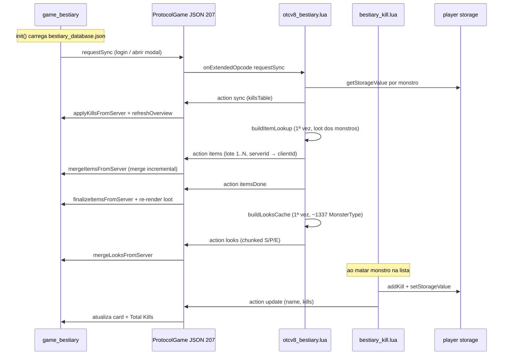
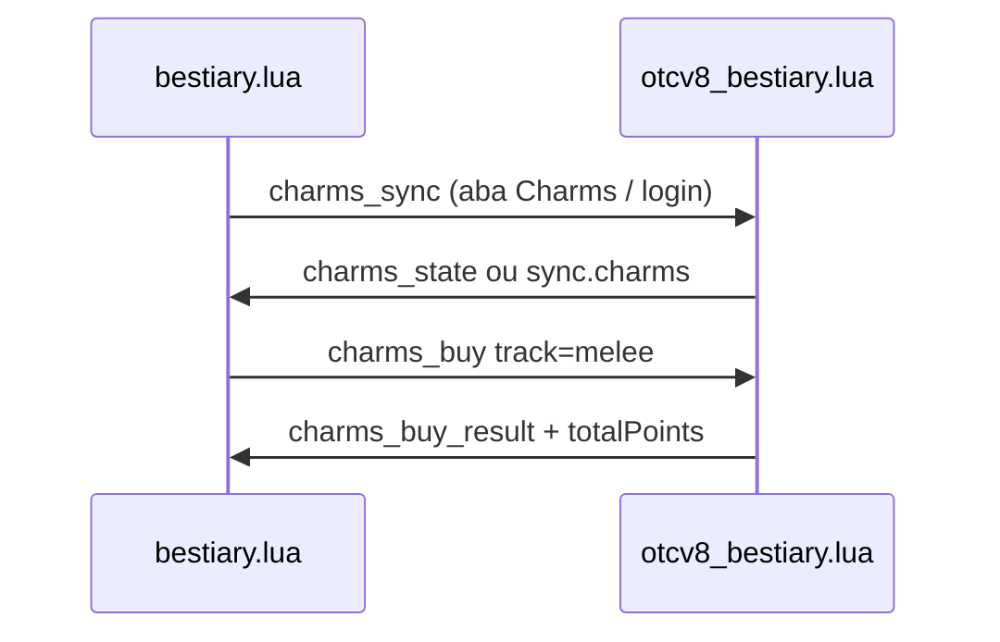

# Bestiary — cliente OTCv8 (opcode 207)

Modal **Bestiary** no OTClientV8: catálogo local de criaturas (HP, EXP, resistências, loot, categorias) + **kills e sprites oficiais** sincronizados com o TFS via extended opcode **207**.

| Doc | Conteúdo |
|-----|----------|
| **Servidor (storage, kills, looks)** | [`../../server/docs/BESTIARY-MODULE.md`](../../server/docs/BESTIARY-MODULE.md) |
| **Log cliente** | [`SESSION-LOG.md`](SESSION-LOG.md) |
| **Extended opcodes (geral)** | [`SHOP-MODULE.md`](SHOP-MODULE.md) — `protocolgame.lua`, `GameExtendedOpcode` |
| **Assets pedestal** | [`UI-CHROME-ASSETS.md`](UI-CHROME-ASSETS.md) — `/images/ui/bestiary_base` |

---

## Visão geral

O Bestiary é um sistema **híbrido**:

| Dado | Origem | Motivo |
|------|--------|--------|
| Nome, grupo, dificuldade, HP, EXP, weakness, loot | **Cliente** — `bestiary_database.json` (~1337 entradas, ~2 MB) | Evita enviar megabytes no login; UI instantânea offline |
| Contagem de abates (kills) | **Servidor** — player storage | Fonte autoritativa anti-cheat |
| Look type / lookTypeEx (sprite) | **Servidor** — `MonsterType(name):getOutfit()` | Mesmo outfit do XML/spawn, não depende do JSON estático |

O cliente **não recalcula** kills — só aplica o JSON do servidor. HP/loot/resistências vêm do JSON local até haver sync server-side no futuro.



---

## Opcode e protocolo

| Opcode | Direção | Payload |
|--------|---------|---------|
| **207** | Cliente → servidor | `{ "action": "requestSync" }` |
| **207** | Servidor → cliente | `{ "action": "sync", "data": { "Rotworm": 5, ... } }` |
| **207** | Servidor → cliente | `{ "action": "update", "data": { "name": "Rotworm", "kills": 6 } }` |
| **207** | Servidor → cliente | `{ "action": "items", "data": { "2148": { "c": 3031, "n": "gold coin" }, ... } }` (lotes) |
| **207** | Servidor → cliente | `{ "action": "itemsDone", "data": { "total": 1234 } }` |
| **207** | Servidor → cliente | `{ "action": "looks", "data": { "v": 1, "names": [], "types": [], "aux": [] } }` |
| **207** | Cliente → servidor | `{ "action": "charms_sync" }` |
| **207** | Cliente → servidor | `{ "action": "charms_buy", "track": "melee" }` |
| **207** | Servidor → cliente | `{ "action": "charms_state", "data": { "totalPoints": 42, "tracks": { "melee": 8, ... } } }` |
| **207** | Servidor → cliente | `{ "action": "charms_buy_result", "data": { "ok": true, "track": "melee", "level": 9, "totalPoints": 33, "tracks": {...}, "message": "..." } }` |
| **207** | Servidor → cliente | `sync` / `update` incluem `totalPoints` e `charms` (mapa de níveis por trilha) quando disponível |

**Requisitos:**

- `GameExtendedOpcode` ligado para versão **≥ 860** em `modules/game_features/features.lua`
- Servidor envia extended opcode **0** no login OTClient (`protocolgame.cpp`) para habilitar envio no cliente
- Chunking JSON grande: prefixos **`S` / `P` / `E`** — montagem em `modules/gamelib/protocolgame.lua` (**um buffer por opcode** — não intercalar `sync` com stream S/P/E aberto)

**Nota:** `protocolcodes.h` define `GameServerLootTracker = 207` como opcode **nativo** do protocolo Tibia. Isso **não conflita** com o sub-opcode **207** dentro do pacote **`0x32` (extended opcode)** — caminhos de parse diferentes em `protocolgameparse.cpp`.

---

## Como usar in-game

1. Servidor com `ExtendedOpcodeBestiary` + `BestiaryKill` registrados no login.
2. Botão **Bestiary** na barra superior direita (ícone quest log).
3. Atalho: **Ctrl+Shift+B**.
4. Busca: digite ≥ 2 letras ou escolha uma **classe** à esquerda (evita renderizar 1300+ cards de uma vez).
5. Clique num card → painel de detalhes (HP, EXP, elementos, loot, progresso).

### Sync automático

| Momento | Comportamento |
|---------|----------------|
| `onGameStart` | `requestSync` em **800 ms** (único reforço no login) |
| Abrir modal (`toggle`) | `requestServerSync()` imediato |
| Matar monstro | Servidor envia `update` em tempo real |
| Login servidor | `scheduleLoginSync` — kills em **1,5 s** (sem looks, só abates) |
| `requestSync` completo | Servidor: pipeline serial kills → items (lotes) → looks (`startSyncPipeline`) |
| Kill toast (incompleto) | Pacote **`update`** ou delta no **`sync`** periódico — ver [Kill toasts](#kill-toasts-no-mapa) |

---

## Kill toasts no mapa

Notificações leves no **canto superior esquerdo do `gameMapPanel`** ao matar criaturas do bestiary **ainda incompletas**.

### Comportamento

| Situação | UI |
|----------|-----|
| Kill incompleto | Pedestal pedra + sprite + `Rotworm  5/25` (teal) |
| Várias mortes do **mesmo** monstro (combo/AoE) | **Uma linha** atualiza o contador; timer reinicia (2,8 s) |
| Mortes de **espécies diferentes** | Até **N linhas** empilhadas (N configurável; padrão **5**); a (N+1)ª expulsa a mais antiga com fade |
| Completa meta (ex. 25/25) | Toast dourado: *"Rotworm — Bestiary completo!"* (só na transição) |
| Já completo antes | Sem toast de progresso |
| Tempo na tela | **2,8 s** → fade **0,5 s** → remove; linhas restantes sobem (layout vertical) |

### Disparo (cliente)

| Fonte | Quando |
|-------|--------|
| Pacote **`update`** | Kill em tempo real (`bestiary_kill.lua` → `sendSingleKillUpdate`) — **principal** |
| Delta no **`sync`** | Compara kills antes/depois do sync periódico (`detectSyncKillDeltas`); só após 1º sync (`killToastReady`) |

Sem toast no **1º sync** de login (evita spam ao entrar).

### Opções (Game)

| Opção | Chave | Default | Descrição |
|-------|-------|---------|-----------|
| Bestiary kill notifications on screen | `showBestiaryKillToasts` | `true` | Liga/desliga toasts; ao desligar, limpa os visíveis |
| Bestiary toast lines | `bestiaryKillToastMaxLines` | `5` | Slider **1–10** — máximo de **espécies diferentes** simultâneas |

Arquivos: `client_options/game.otui`, `client_options/options.lua`.

### UI — overlay e widget

O overlay é **filho direto do `gameMapPanel`** (mesmo padrão de FPS/Ping e ícones do bot), **não** filho aninhado que o mapa desenha por cima.

```
gameMapPanel
  └── bestiaryKillToastOverlay (phantom, verticalBox, top-left)
        └── BestiaryKillToast × até N
              ├── toastSpriteBg (pedestal #8b8378 — contraste p/ mobs escuros)
              │     └── toastSprite (UICreature, scale 0.72)
              └── toastLabel
```

Margens ajustadas por `adjustKillToastOverlayMargin()` usando o retângulo real de desenho do mapa (`UIMap:getMapRect()` ou estimativa Lua) — o toast fica no canto superior esquerdo **dos tiles**, não na faixa cinza do widget. Ver também [`VIEWPORT-CLASSIC-VIEW.md`](VIEWPORT-CLASSIC-VIEW.md) (Classic ON/OFF e `getMapRect`).

### Arquivos

| Arquivo | Função |
|---------|--------|
| `bestiary_killtoast.otui` | Estilo `BestiaryKillToast` + root `bestiaryKillToastOverlay` |
| `bestiary.lua` | `handleKillToast`, `showProgressToast`, `showCompleteToast`, `getKillToastMaxLines`, `enforceMaxVisibleToasts` |
| `game_interface/gameinterface.lua` | Chama `adjustKillToastOverlayMargin` no `updateSize` |
| `client_options/game.otui` | Toggle + slider de linhas |
| `client_options/options.lua` | Defaults e handlers |

### Constantes (Lua)

```lua
KILL_TOAST_HOLD_MS = 2800
KILL_TOAST_FADE_MS = 500
KILL_TOAST_MAX_LINES_DEFAULT = 5   -- override: getOption('bestiaryKillToastMaxLines') 1..10
```

Sprite toast: `applyCreatureOutfit(..., { toast = true })` — usa **`recursiveGetChildById('toastSprite')`** (widget aninhado em `toastSpriteBg`).

### Cores

| Estado | Borda toast | Texto | Pedestal sprite |
|--------|-------------|-------|-----------------|
| Progresso | `#00ffcc88` | `#00ffccff` | `#8b8378cc` |
| Completo | `#ffd700aa` | `#ffd700ff` | `#9a8a5ccc` (dourado) |

### Performance

- Máx. **N** `UICreature` estáticos (`setAnimate(false)`, scale **0.72**)
- 1 widget por espécie (`activeProgressToasts`) — combo não multiplica sprites
- Opções desligam feed ou reduzem linhas sem reiniciar

### Desativar / limitar

- Opções → Game → **Bestiary kill notifications on screen**
- Opções → Game → **Bestiary toast lines** (1–10)

### Troubleshooting toasts

| Sintoma | Causa | Correção |
|---------|-------|----------|
| Toast de texto OK, **sprite vazio/preto** | `getChildById('toastSprite')` não acha filho aninhado | Usar `recursiveGetChildById` (corrigido) |
| Toast de texto OK, sprite invisível | Fundo preto + mob escuro | Pedestal `toastSpriteBg` cinza-pedra |
| Nada na tela, log `[Bestiary] toast:` OK | Overlay no layer errado | Overlay via `loadUI(..., getMapPanel())` + `raise()` |
| Toast na faixa cinza fora do mapa | Ancorado no widget, não em `m_mapRect` | `adjustKillToastOverlayMargin()` com `getMapRect()` |
| Nenhum toast ao matar | `showBestiaryKillToasts` off | Opções → Game |
| Só no relog, não ao matar | Servidor sem `BestiaryKill` ou `update` falha | Ver `login.lua` + XML; log TFS `sendUpdate` |
| Monstro já completo | Sem toast de progresso | Esperado |
| Burst de toasts no sync | Vários `requestSync` + delta | Debounce no servidor (1 s); preferir `update` live |
| `Invalid data in extended JSON opcode (207)` | Chunks S/P/E sobrepostos (looks + sync) | Servidor: looks 1×/sessão + debounce; ver doc servidor |

Log saudável após kill: `[Bestiary] toast: Rotworm 5/25` + sprite visível no pedestal.

## Arquivos do módulo (cliente)

| Arquivo | Função |
|---------|--------|
| `modules/game_bestiary/bestiary.lua` | UI, opcode 207, índices, grid, detalhes, sync, **kill toasts** |
| `modules/game_bestiary/bestiary.otui` | Layout modal 800×520, abas, Charms, cards, painel detalhes |
| `modules/game_bestiary/bestiary_killtoast.otui` | Overlay de toasts no mapa |
| `modules/game_bestiary/bestiary.otmod` | `autoload: true`, depende de `game_interface` |
| `modules/game_bestiary/bestiary_database.json` | Catálogo estático (**não deletar**) |
| `modules/gamelib/protocolgame.lua` | `registerExtendedJSONOpcode`, chunk S/P/E |
| `modules/game_features/features.lua` | `GameExtendedOpcode` ≥ 860 |

**Após mudar Lua/OTUI:** reiniciar `otclient_gl.exe` (sem rebuild C++).

**Após mudar JSON:** reiniciar cliente (carregado uma vez no `init()`).

---

## Charms — upgrades permanentes (opcode 207)

Compra de bônus de **ataque** com **Charm Points** (storage `149999` no servidor). UI na aba **Charms**; combate aplica bônus no TFS (C++ — ver doc servidor).

### Trilhas (Fase 1 — ataque)

| ID `track` | Efeito | Cap |
|------------|--------|-----|
| `melee` | +1% dano físico melee (sword, axe, club) por nível | 20% |
| `distance` | +1% dano distance (bow, crossbow, throw) | 20% |
| `magic_fire` … `magic_death` | +1% dano da magia do elemento | 20% / elem |

Elementos mágicos: `magic_physical`, `magic_earth`, `magic_fire`, `magic_ice`, `magic_energy`, `magic_holy`, `magic_death`.

### Custo por nível (espelhado em `CHARM_COST_TIERS` no Lua)

| Próximo nível | Custo (pts) |
|---------------|-------------|
| 1–5 | 25 |
| 6–10 | 50 |
| 11–15 | 100 |
| 16–20 | 200 |

Maxar uma trilha: **1.875 pts**. Ver tabela completa em [`ideias para BESTIARY.md`](ideias%20para%20BESTIARY.md).

### Fluxo cliente



| Função Lua | Papel |
|------------|-------|
| `setMainTab` | Alterna Catálogo / Charms / Conquistas |
| `initCharmsUI` / `refreshCharmsUI` | Monta cards e barra de progresso |
| `buyCharmTrack(trackId)` | Envia `charms_buy` |
| `requestCharmsSync` | Envia `charms_sync` |
| `applyCharmsState` | Atualiza `charmTrackLevels` + labels |
| `handleCharmsBuyResult` | Feedback + refresh após compra |

Widgets OTUI: `BestiaryCharmRow`, `BestiaryCharmRowSmall`, `charmsPanel`, `charmCategoryList`.

Sidebar Charms: **Ataque** (ativo), Resistência / Loot / Cap desabilitados ("Em breve").

---

## Layout da UI

### Janela principal (`MainWindow` 800×520)

| Área | Widget OTUI | Descrição |
|------|-------------|-----------|
| Topo | `topTabBar` | Abas **Catálogo** \| **Charms** \| **Conquistas** (última desabilitada) |
| Topo direito | `overviewStats` | **Charm Points** + **Total Kills** (fixos em todas as abas) |
| Corpo | `bodyPanel` | Sidebar 180 px + conteúdo principal |
| Catálogo — sidebar | `categoryList` | Botões `BestiaryCategoryButton` por `creature.group` |
| Charms — sidebar | `charmCategoryList` | Categorias de upgrade (Ataque default) |
| Catálogo — main | `catalogPanel` | Busca, filtros, grid |
| Charms — main | `charmsPanel` | Melee, Distance, grid elemental |
| Busca | `searchEdit` | Filtro por nome (debounce 200 ms) |
| Status | `gridStatus` | Mensagens de filtro / limite / vazio |
| Grid | `monsterGrid` | Cards `BestiaryMonsterCard` (grid 140×175, max **96** visíveis) |
| Detalhes | `detailsPanel` | Painel 360 px à direita; `detailsBackdrop` escurece sidebar/grid, absorve cliques (`onMousePress` + `setEnabled(false)` no fundo) |

### Card de monstro (`BestiaryMonsterCard` 140×180)

| Elemento | ID | Notas |
|----------|-----|-------|
| Pedestal | `spriteBase` | Imagem `/images/ui/bestiary_base` |
| Sprite | `sprite` | `UICreature`, scale **0.85**, `old-scaling: true` |
| Nome | `name` | Centralizado |
| Dificuldade | `difficulty` | Badge colorido (Inofensivo → Difícil) |
| Barra | `progress` | 4 px, cor `#00ffcc`; margem **10 px** abaixo do badge |
| Texto | `kills` | Formato `5/25 kills` |

### Painel de detalhes

| Seção | IDs | Conteúdo |
|-------|-----|----------|
| Palco | `detailStage`, `detailSprite` | Sprite 96 px, scale **1.5**, rotação auto |
| Stats | `detailHp`, `detailExp` | Chips HP / EXP do JSON |
| Elementos | `resistGrid` | 7 chips (`BestiaryElementChip`) — verde &lt; 100%, vermelho &gt; 100% |
| Saque | `lootGrid` | **0 kills:** cadeado + label `Bloqueado` (sem preview do item); tooltip com instrução. **≥1 kill:** `UIItem` + `lootItemName`; ícone via mapa `items` do servidor |
| Progresso | `detailProgressPanel` | Label + `ProgressBar` 10 px (fill **`#ffd700`** dourado; trilho com borda `#333`) |

### Dificuldades (cliente — `BestiaryDifficulty`)

| ID | Nome UI | Kills para completar | Pontos (futuro) |
|----|---------|----------------------|-----------------|
| 1 | Inofensivo | 25 | 1 |
| 2 | Fácil | 500 | 15 |
| 3 | Médio | 1000 | 25 |
| 4 | Difícil | 2500 | 50 |

Campo `creature.difficulty` no JSON (1–4).

---

## Schema — `bestiary_database.json`

Array de objetos. Exemplo mínimo:

```json
{
  "name": "Rotworm",
  "group": "Vermin",
  "difficulty": 1,
  "hp": 65,
  "exp": 40,
  "lookId": 0,
  "kills": 0,
  "weakness": [
    { "element": "physical", "val": 100 },
    { "element": "earth", "val": 110 }
  ],
  "loot": [
    { "chance": 40000, "countmax": 20, "name": "gold coin" },
    { "chance": 5000, "countmax": 1, "name": "meat", "id": 2666 }
  ]
}
```

| Campo | Tipo | Uso |
|-------|------|-----|
| `name` | string | Chave de match com servidor (**case-insensitive** no cliente) |
| `group` | string | Categoria na sidebar |
| `difficulty` | 1–4 | Badge + meta de kills |
| `hp`, `exp` | number | Painel detalhes |
| `lookId` | number | Fallback local; **sobrescrito** por `looks` do servidor |
| `weakness` | array | `element` + `val` (% dano; 100 = neutro) |
| `loot` | array | **`name`** (preferido) e/ou **`id`** (serverId TFS); `chance` = ‰ (÷ 1000 → %) |
| `kills` | number | Sempre zerado no load; preenchido pelo servidor |

**Elementos válidos:** `physical`, `earth`, `fire`, `ice`, `energy`, `holy`, `death`.

### Loot — ícones e nomes

O JSON guarda **serverId** (`id`) e/ou **nome** (`name`) do loot. O OTC **não** carrega `items.otb` / `items.xml` (só `Tibia.dat` + `.spr` em `game_things/things.lua`), portanto **`g_things.findItemTypeByName` e scan local não funcionam** para resolver sprites.

**Padrão Stock / Combat Power:** o servidor envia action **`items`** em **lotes** (opcode 207) com mapa `serverId → { c: clientId, n: name }`. O cliente mescla em `BestiaryItemLookup` e renderiza com `Spells.applyItemIcon()` — ver [`game_combatpower/combatpower.lua`](../modules/game_combatpower/combatpower.lua).

| Campo JSON loot | Origem | Resolução no cliente |
|-----------------|--------|----------------------|
| `name` | loot XML / `items.xml` | Match em `BestiaryItemLookup` por nome (após sync `items`) |
| `id` | serverId TFS | `BestiaryItemLookup[tostring(id)]` |
| `clientId` | (futuro export) | Usado direto, sem lookup |

**Regra:** nunca passar serverId em `UIItem:setItemId()` — só **clientId** do `.dat`. Ver também [`COMBAT-POWER-MODULE.md`](COMBAT-POWER-MODULE.md).

Log esperado após login: `[Bestiary] Mapa de itens sincronizado: N entradas` (após `itemsDone`). Se loot abrir antes, slot vazio até `itemsDone` (re-render automático).

---

## Implementação Lua — funções principais

| Função | Papel |
|--------|-------|
| `loadDatabase()` | `json.decode` do arquivo local; zera kills |
| `buildDatabaseIndexes()` | `creatureByNameLower`, `creaturesByGroup` (lazy, uma vez) |
| `onExtendedJSONOpcode` | Dispatch `sync` / `update` / `looks` / `items` / `itemsDone` / `charms_state` / `charms_buy_result` |
| `setMainTab` / `refreshCharmsUI` / `buyCharmTrack` | Aba Charms e compra de upgrades |
| `mergeItemsFromServer` | Mescla lote em `BestiaryItemLookup` |
| `finalizeItemsFromServer` | Após `itemsDone`; log + re-render loot |
| `resolveDropItem` | serverId/nome → `{ clientId, name }` via mapa do servidor |
| `applyKillsFromServer` | Match por `name:lower()` |
| `mergeLooksFromServer` | Preenche `lookId` / `lookTypeEx` por índice paralelo |
| `applyCreatureOutfit` | `{ type }` ou `{ auxType }` no `UICreature` |
| `updateMonsterGrid` | Filtro + limite 96 + criação dinâmica de cards |
| `showCreatureDetails` | Monta painel lateral |
| `renderLootSection` | Loot bloqueado / desbloqueado / vazio |
| `handleKillToast` / `showProgressToast` / `showCompleteToast` | Feed de kill toasts no mapa |
| `getKillToastMaxLines` / `enforceMaxVisibleToasts` | Limite configurável (Opções → Game) |
| `detectSyncKillDeltas` | Toasts quando sync periódico detecta kills novos |
| `adjustKillToastOverlayMargin` | Margem top-left no layout modern |
| `requestServerSync` | Envia `{ action = "requestSync" }` se `GameExtendedOpcode` ativo |

### Constantes de performance

| Constante | Valor | Motivo |
|-----------|-------|--------|
| `BESTIARY_GRID_LIMIT` | 96 | Evita milhares de `UICreature` simultâneos |
| `SEARCH_DEBOUNCE_MS` | 200 | Debounce na busca |
| `KILL_TOAST_HOLD_MS` / `KILL_TOAST_FADE_MS` | 2800 / 500 | Duração visível e fade dos toasts |
| `bestiaryKillToastMaxLines` (opção) | 1–10 (default 5) | Cap de espécies diferentes no mapa |
| Regra "All" sem busca | ≥ 2 chars | Mensagem `gridStatus` em vez de grid vazio pesado |

---

## Registro do opcode — armadilha crítica

**Correto (atual):** registrar **sempre** no `init()`, igual Shop/Combat Power:

```lua
ProtocolGame.registerExtendedJSONOpcode(207, onExtendedJSONOpcode)
```

**Errado (bug histórico):** registrar só se `g_game.getFeature(GameExtendedOpcode)` no `init()`.

No startup, `setClientVersion(860)` ainda **não** rodou → feature desligada → handler **nunca** registrado. O cliente **enviava** `requestSync` após login (feature já ligada), o servidor **respondia**, mas o cliente **ignorava** a resposta → **Total Kills: 0** forever.

**Sintoma no log:** `[Bestiary] Carregados 1337 monstros...` sem linhas `[Bestiary] sync:` ou `Looks oficiais sincronizados`.

**Envio** continua protegido por `getFeature` em `requestServerSync()` — só recepção precisa do handler registrado cedo.

---

## Logs esperados (`otclientv8.log`)

```
[Bestiary] Carregados 1337 monstros da base de dados com sucesso!
[Bestiary] sync: 2 especies com kills
[Bestiary] Looks oficiais sincronizados: 1337 monstros
[Bestiary] toast: Rotworm 5/25
```

Erros possíveis:

```
[Bestiary] onExtendedJSONOpcode: dado invalido ...
[Bestiary] Pacote 'looks' invalido do servidor
Invalid data in extended JSON opcode (207): ...
```

---

## Troubleshooting

| Sintoma | Causa provável | Ação |
|---------|----------------|------|
| **Total Kills: 0** com kills no servidor | Handler 207 não registrado no `init()` | Ver seção acima; reiniciar cliente |
| Servidor loga `sendKills` mas cliente silencioso | Mesmo bug ou JSON decode falhou | Ver `Invalid data in extended JSON opcode` |
| Kills no servidor, 0 no card | Nome do monstro ≠ entrada no JSON | Conferir `target:getName()` vs `bestiary_database.json` |
| Sprite errado / genérico | Looks ainda não chegaram | Aguardar pacote `looks` (1ª sync demora no servidor) |
| Loot com ícone errado ou slot vazio | Sync `items`/`itemsDone` incompleto ou colisão opcode 207 | Aguardar log `Mapa de itens sincronizado`; reiniciar servidor; ver erros `Invalid data in extended JSON opcode (207)` |
| Grid vazio em "All Classes" | Comportamento intencional | Buscar ≥ 2 letras ou escolher classe |
| `Unable to send extended opcode` | `GameExtendedOpcode` off | `features.lua` versão ≥ 860 |
| Kills antigas perdidas após fix storage | Hash case-sensitive antigo | Rematar ou migrar storages (ver doc servidor) |
| 1ª abertura lenta | `buildLooksCache()` no TFS | Pré-build no boot (`startup.lua` — ver doc servidor) |
| Toasts não aparecem | Overlay / opcode 207 | Ver seção [Kill toasts](#kill-toasts-no-mapa) — `getMapPanel()`, chunk JSON |
| Sprite do toast vazio | `toastSprite` aninhado | `recursiveGetChildById` + pedestal `toastSpriteBg` |
| Toast só no relog, não ao matar | Servidor sem `BestiaryKill` | Ver `login.lua` + XML |

**Debug servidor:** log `[Otcv8Bestiary] sendKills Nome: X abates em Y especies` em `data/logs/tfs/`.

---

## Manutenção — onde editar

| Quero… | Onde |
|--------|------|
| Layout / cores / padding cards | `bestiary.otui` |
| Textos PT / lógica UI | `bestiary.lua` |
| Adicionar monstro ao catálogo | `bestiary_database.json` + `server/data/lib/bestiary_monsters.lua` |
| Meta de kills / dificuldade UI | `BestiaryDifficulty` em `bestiary.lua` |
| Novo monstro contável no servidor | Nome em `BestiaryMonsterNames` + XML monster |
| Corrigir sprite oficial | Servidor — `MonsterType` / XML outfit |
| Opcode / payload | `otcv8_bestiary.lua` (servidor) + `onExtendedJSONOpcode` (cliente) |
| Toasts (tempo, cores, cap) | `bestiary.lua` + `bestiary_killtoast.otui` + Opções → Game |
| Desligar toasts / linhas máx. | `client_options/options.lua` — `showBestiaryKillToasts`, `bestiaryKillToastMaxLines` |
| Imagem pedestal | `data/images/ui/bestiary_base.png` (ou layout modern) |

---

## Melhorias futuras (roadmap)

Itens já anotados no código ou identificados em testes:

### Prioridade alta

1. **Tela "Carregando…" no login** — enquanto `looks` + `sync` não completam (`bestiary.lua`; asset `carregando.png` em layout modern).
2. ~~**Pré-build do cache de looks no servidor**~~ — implementado: `startup.lua` → `scheduleStartupLooksCache()` (+5 s após boot).
3. **Migrar storages antigas** — script one-shot se jogadores tinham kills com hash case-sensitive (antes de `name:lower()` no `getStorageKey`).

### Prioridade média

4. **Opcode separado para looks (208?)** — evita corrida S/P/E no mesmo 207 que `sync`/`update`.
5. **Enviar looks só ao abrir Bestiary** — reduz tráfego no login.
6. ~~**Bestiary points / charm**~~ — **Fase 1 ataque** implementada (aba Charms + opcode 207); resist/loot/cap pendentes.
7. **Sync parcial de kills** — enviar só espécies com kills &gt; 0 (já feito no `sendKills`; manter ao escalar).
8. **Atualizar JSON a partir do TFS** — script export HP/loot/resist do `MonsterType` para manter JSON alinhado.

### Prioridade baixa / UX

9. **Ordenar grid** — por kills, nome, dificuldade, incompletos primeiro.
10. **Indicador visual "completo"** — card quando kills ≥ meta da dificuldade.
11. ~~**Kill toasts no mapa**~~ — implementado: overlay no `gameMapPanel`, pedestal sprite, opções Game (toggle + linhas 1–10).
12. ~~**Cap configurável de linhas de toast**~~ — `bestiaryKillToastMaxLines` (Opções → Game).
13. **Filtro "só com progresso"** — toggle na toolbar.
14. **Detalhe: histórico de kill rate** — requer dados extras no servidor.
15. **i18n** — strings hardcoded PT/EN misturadas (`Inofensivo` vs `Search creature...`).
16. **Contador destacado no toast** — ex.: nome + `7/25` em cores diferentes.

### Performance

17. **Pool de cards** — reciclar widgets em vez de `destroyChildren` a cada keystroke.
18. **Virtual scroll** — só renderizar cards visíveis no viewport.
19. **Comprimir payload looks** — arrays paralelos ok; considerar delta por versão (`data.v`).

---

## Teste rápido

1. Reiniciar **tfs.exe** e **otclient_gl.exe**.
2. Login com personagem que matou rotworms.
3. Abrir Bestiary → buscar `rotw`.
4. Verificar **Total Kills** &gt; 0 e barra `X/25 kills`.
5. Matar mais um rotworm → contador sobe **sem relog** (pacote `update`).
6. **Kill toast** no canto superior esquerdo: pedestal + `Rotworm  N/25`.
7. Combo no mesmo monstro → **uma linha** atualiza; espécies diferentes → até N linhas (padrão 5).
8. Completar 25/25 → toast dourado *Bestiary completo!*
9. Opções → Game → desligar **Bestiary kill notifications** → sem toasts.
10. Opções → Game → **Bestiary toast lines** (1–10) → testar 6ª espécie expulsando a mais antiga.
11. Aba **Charms** → ver Melee/Distance/elementos → **Comprar +1%** (requer Charm Points e TFS recompilado para dano).
12. Após compra: barra sobe, pontos descontam, mensagem no chat (servidor).

---

## Referências cruzadas (outros opcodes)

| Opcode | Módulo | Não misturar handlers |
|--------|--------|------------------------|
| 201 | Shop | `ExtendedOpcodeShop` |
| 202 | Spell list | `ExtendedOpcodeSpellList` |
| 203 | Combat Power | `ExtendedOpcodeCombatPower` |
| 204+ | Stock, Party, etc. | Handlers separados |
| **207** | **Bestiary** | **`ExtendedOpcodeBestiary`** |

Servidor: ver [`../../server/docs/BESTIARY-MODULE.md`](../../server/docs/BESTIARY-MODULE.md).
