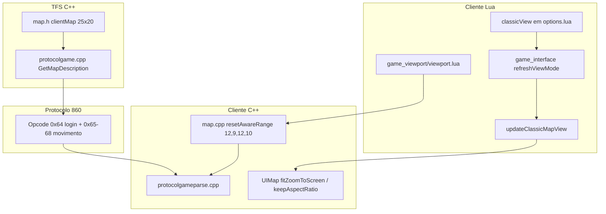

# Viewport 25×20 e Classic view (OTCv8)

Documentação do sistema de mapa visível no cliente **otc-server** e alinhamento com o TFS.

**Pare servidor:** [`../../server/docs/VIEWPORT-MODULE.md`](../../server/docs/VIEWPORT-MODULE.md)

---

## Resumo executivo

| Conceito | O que é |
|----------|---------|
| **Viewport (rede)** | Quantos tiles o **servidor envia** no opcode `0x64` e movimento — hoje **25×20** |
| **Classic view** | Opção em **Interface** — controla só **como o cliente desenha** o mapa no painel |
| **Layout da tela** | Painéis laterais, chat, action bar, top bar — **igual** com Classic ON ou OFF |

**Regra de ouro:** Classic view **não** é “modo wide da interface OTC original”. É apenas zoom/proporção do mapa dentro do layout clássico.

---

## O que o usuário vê

### Classic view **ON** (padrão em desktop)

- Mapa com proporção **Tibia clássica** (~15×11 visível, `keepAspectRatio`)
- **Barras cinzas** nas laterais do painel do mapa — esperado (letterbox)
- Painéis laterais (Minimap, Inventário, etc.) **inalterados**
- Left/Right panels das opções continuam funcionando

### Classic view **OFF**

- **Mesmo layout** de tela (âncoras, chat, painéis `#7B6A72`)
- Mapa usa **`fitZoomToScreen`** para preencher a **largura** do painel
- Usa os **25 tiles** que o servidor já envia — **sem faixas pretas** por falta de dados
- **Não** estica sprites (sem `stretchMap`); **não** muda console/actionbar para modo “wide”

### Erro comum (corrigido em 2026-06)

| Sintoma | Causa antiga |
|---------|----------------|
| Classic OFF mudava painéis, chat, mapa full-screen | Modo “wide” do OTCv8 original (`fill('parent')`, margens negativas) |
| Faixas **pretas** com Classic OFF | Cliente esticava UI mas servidor ainda mandava **18×14** tiles |
| Toast Bestiary na faixa cinza | Overlay ancorado no widget, não na área de tiles (`getMapRect`) |

---

## Arquitetura



### Três camadas independentes

1. **Protocolo (25×20)** — servidor + `g_map.setAwareRange` + parser. Fixo após login; **relog** necessário se mudar no servidor.
2. **Layout UI** — `gameinterface.otui` + `refreshViewMode()`. **Não** depende de Classic view (desde a correção).
3. **Zoom do mapa** — `updateClassicMapView()` + `init.lua` (`CLASSIC_MAP_*`). **Depende** de Classic view.

---

## Valores numéricos

### Servidor e cliente (devem coincidir)

| Campo | Valor |
|-------|-------|
| Largura total | **25** tiles |
| Altura total | **20** tiles |
| `left` | 12 |
| `right` | 12 |
| `top` | 9 |
| `bottom` | 10 |

Fórmula Tibia: `width = left + right + 1`, `height = top + bottom + 1`.

### Antigo (Tibia 8.60 vanilla) — não usar neste fork

| | 18×14 | aware 8,6,9,7 |
|--|-------|----------------|

---

## Classic view — fluxo no cliente

```
Opções → classicView alterado
    → options.lua chama modules.game_interface.refreshViewMode()
        → âncoras clássicas (gameTopBar, action panels)
        → painéis laterais #7B6A72 (sempre)
        → modules.game_viewport.sync()  [aware range 25×20]
        → updateClassicMapView()
            → ON:  setKeepAspectRatio(true) + zoom por altura
            → OFF: fitZoomToScreen() + refreshMapGeometry()
        → updateSize() + bestiary toast margin
```

### `updateClassicMapView()` (`gameinterface.lua`)

| Classic | C++ / Lua |
|---------|-----------|
| ON | `setVisibleDimension(15,11)`, `setKeepAspectRatio(true)`, zoom ímpar por `CLASSIC_MAP_TARGET_TILE_PX` |
| OFF | `fitZoomToScreen(targetPx, min, max)`, `refreshMapGeometry()`, `setLimitVisibleRange(false)` |

### Tuning em `init.lua`

```lua
CLASSIC_MAP_TARGET_TILE_PX = 40   -- pixels por tile alvo (altura do painel / zoom)
CLASSIC_MAP_ZOOM_FALLBACK = 11    -- zoom mínimo
CLASSIC_MAP_ZOOM_MAX = 21         -- zoom máximo
```

| Constante | Efeito |
|-----------|--------|
| `TARGET_TILE_PX` menor | Tiles maiores, menos tiles visíveis |
| `TARGET_TILE_PX` = 0 | Desliga tuning; fallback zoom 11 |
| `ZOOM_MAX` | Limite superior (engine também usa `setMaxZoomOut`) |

---

## Arquivos do cliente

| Arquivo | Papel |
|---------|--------|
| `init.lua` | `CLASSIC_MAP_*` — tuning de zoom |
| `modules/client_options/options.lua` | `classicView` default; dispara `refreshViewMode` |
| `modules/client_options/interface.otui` | Checkbox Classic view |
| `modules/game_interface/gameinterface.lua` | `refreshViewMode`, `updateClassicMapView`, `updateSize` |
| `modules/game_interface/gameinterface.otui` | Layout: `gameMapPanel` entre painéis |
| `modules/game_viewport/viewport.lua` | `g_map.setAwareRange(12,9,12,10)` |
| `modules/game_features/features.lua` | `GameBiggerMapCache` no protocolo 860 |
| `src/client/map.cpp` | `resetAwareRange()` espelha servidor |
| `src/client/uimap.cpp` | `fitZoomToScreen`, `refreshMapGeometry`, `clampVisibleDimensionToAwareRange` |
| `src/client/mapview.cpp` | `setStretchMap(false)` — sem distorção de sprites |
| `modules/game_bestiary/bestiary.lua` | Toast no mapa via `getMapRect()` |

### Opcode 206 (viewport dinâmico)

Existe `server/data/lib/otcv8_viewport.lua` e handler no cliente, mas **não** é usado no login neste fork. O servidor **sempre** envia 25×20; trocar range em runtime sem re-login causou dessync no passado (ver histórico em `otserv_860/docs/VIEWPORT-MODULE.md`).

---

## Build e deploy

| Mudança | Rebuild |
|---------|---------|
| `server/src/map.h`, `protocolgame.cpp` | **tfs.exe** (`server/build_win`, ver `server/docs/BUILD.md`) |
| `client/src/**` (map, uimap, mapview) | **otclient_gl.exe** (`client/scripts/build-client.ps1`) |
| Só `gameinterface.lua`, `init.lua`, `viewport.lua` | Reiniciar cliente |
| Só `data/*.lua` no servidor | Reiniciar tfs |

Após mudar viewport no servidor: **relog obrigatório** (mapa inicial no opcode `0x64`).

---

## Teste manual

1. `tfs.exe` e `otclient_gl.exe` novos; relogar.
2. Opções → **Left panels** / **Right panels** como desejado (ex.: 0 e 2).
3. **Classic ON** → barras cinzas no mapa; painéis laterais normais.
4. **Classic OFF** → mapa largo preenchendo o painel; **sem** pretos nas laterais; painéis **iguais**.
5. Matar criatura → toast Bestiary no canto **dos tiles**, não na faixa cinza.
6. Andar nas bordas do mapa 25×20 — sem `invalid id` no log do cliente.

---

## Troubleshooting

| Sintoma | Verificar |
|---------|-----------|
| Desconexão / `invalid id 61823` no 0x64 | Cliente e servidor com **mesmo** aware range; rebuild dos dois |
| Pretos com Classic OFF | `tfs.exe` antigo (ainda 18×14) ou cliente sem relog |
| Classic OFF muda layout inteiro | `gameinterface.lua` antigo com `fill('parent')` — usar versão atual |
| Barras cinzas com Classic ON | Normal — é o letterbox 15×11 |
| `fitZoomToScreen` não existe | Rebuild C++ do cliente (`uimap.cpp` + `luafunctions_client.cpp`) |

---

## Histórico / lições

1. **UI ≠ protocolo** — `vis=17x13` no log é zoom na tela, não tamanho na rede.
2. **Esticar ≠ mais tiles** — `setStretchMap` preenche pixels sem dados do servidor → preto.
3. **Classic view** deve alterar só `updateClassicMapView`, não `refreshViewMode` inteiro.
4. Viewport **29×20** ou `changeMapAwareRange(31,21)` sem TFS alinhado → parse corrompido (não usar).

---

## Referências cruzadas

- Servidor: [`server/docs/VIEWPORT-MODULE.md`](../../server/docs/VIEWPORT-MODULE.md)
- Build cliente: [`BUILD.md`](BUILD.md)
- Build servidor: [`../../server/docs/BUILD.md`](../../server/docs/BUILD.md)
- Bestiary toast no mapa: [`BESTIARY-MODULE.md`](BESTIARY-MODULE.md) (secção kill toasts)
