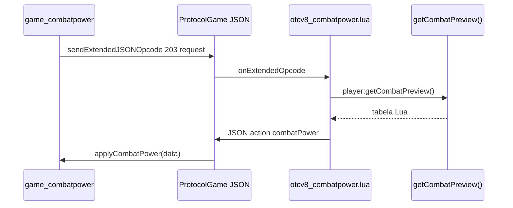

# Combat Power — cliente OTCv8 (opcode 203)

Modal **Combat Power** que exibe poder de combate **calculado no TFS** (ataque, defesa, equipamento, magias e runas de cura). O cliente **não** recalcula dano — só renderiza o JSON do servidor.

| Doc | Conteúdo |
|-----|----------|
| **Servidor + C++ + fases** | [`otserv_860/docs/COMBAT-POWER-PLAN.md`](../../otserv_860/docs/COMBAT-POWER-PLAN.md) |
| **Fórmulas de dano** | [`otserv_860/docs/DAMAGE.md`](../../otserv_860/docs/DAMAGE.md) |
| **Mockup visual** | [`modal combat power.png`](../modal combat power.png) |
| **Patches servidor** | [`otserv_860/docs/SERVER-CHANGES.md`](../../otserv_860/docs/SERVER-CHANGES.md) |

---

## Visão geral



| Opcode | Direção | Payload |
|--------|---------|---------|
| **203** | Cliente → servidor | `{ "action": "request", "data": {} }` |
| **203** | Servidor → cliente | `{ "action": "combatPower", "data": { ... } }` |

Requer **`GameExtendedOpcode`** (`features.lua`).

---

## Arquivos do módulo

| Arquivo | Função |
|---------|--------|
| `modules/game_combatpower/combatpower.lua` | Opcode 203, cache, refresh, montagem das listas |
| `modules/game_combatpower/combatpower.otui` | Layout do modal (580×640) |
| `modules/game_combatpower/combatpower.otmod` | Declaração do módulo |
| `modules/game_interface/interface.otmod` | `load-later` → `game_combatpower` |
| `modules/gamelib/spells.lua` | Ícones (`getSpellIcon`, `getRuneDisplayIcon`, `applyItemIcon`) |

**Após mudar Lua/OTUI:** reiniciar `otclient_gl.exe` (sem rebuild C++).

**Após mudar `src/luascript.cpp` no servidor:** recompilar `tfs.exe` e reiniciar.

---

## Como usar in-game

1. Servidor com `tfs.exe` atualizado + creaturescript `ExtendedOpcodeCombatPower` no login.
2. Botão **Poder de combate** na barra superior direita (ícone *unjustified points*, entre Battle e Shop).
3. Atalho: **Ctrl+Shift+O** (jogo em foco).
4. Botão **Atualizar** no modal força novo request.

### Refresh automático

O cliente pede preview de novo (debounce **450 ms**) quando:

- Abre o modal
- `onInventoryChange` (equipar/desequipar)
- `onLevelChange` / `onSkillChange` / `onMagicLevelChange`
- `onFightModeChange`
- Login (`scheduleEvent` ~900 ms após `onGameStart`)

---

## Layout do modal (580×640)

Referência: [`modal combat power.png`](../modal combat power.png).

### Seções

| Seção | Conteúdo | OTUI |
|-------|----------|------|
| **Cabeçalho** | Vocação, level, modo de luta, attack factor, wield % | `headerLabel` |
| **Ataque (servidor)** | Arma, skill/atk, dano físico, elemento*, dist pvp/mob* | `attackPanel` + `statsSeparator` |
| **Defesa (servidor)** | Defesa, armadura, escudo | `defensePanel` |
| **Equipamento** | Lista com ícone + `[slot] nome, stats` | `equipmentList` |
| **Magias (servidor)** | Instants attack/healing com status colorido | `spellsList` |
| **Cura / runas** | Runas de cura **no inventário** | `healingList` |

\* Linhas `elementRow` / `distanceRow` só aparecem quando o servidor envia dados (ex.: paladin distance).

### Estilo visual

| Elemento | Valor |
|----------|-------|
| Modal | 580×640 px |
| Fonte corpo | `verdana-11px-antialised` |
| Fonte títulos de seção | `verdana-11px-rounded` |
| Painéis de lista | `CombatPowerSectionPanel` (FlatPanel) + `CombatPowerListBox` fundo `#2d2d2d` |
| Stats | Colunas com **anchors** (`attackPanel` ← → `statsSeparator` ← → `defensePanel`); altura base ~124 px (+21 px por linha extra) |
| Margens | Laterais 12 px; 8–10 px entre seções; ícones `margin-left: 4` |

**Títulos de seção:** Ataque `#ff9999`, Defesa `#99ccff`, Equipamento `#aaaaaa`, Magias `#cc88ff`, Runas `#88dd99`.

**Valores de stat:** `#ffcc00` (penalidade de wield: `#ffaa44`).

### Cores de status (magias)

| Status servidor | Fundo linha | Texto | Label no cliente |
|-----------------|-------------|-------|------------------|
| `ok` | `#1a4d2e` | `#44cc66` | OK |
| `soon` | `#4d4020` | `#ffcc44` | `Lv-N` (N = levelDeficit) |
| `locked` | `#4d2020` | `#ffaaaa` | sem Lv |
| `mana` | `#4d3020` | `#ff8844` | sem mana |
| `weapon` | `#4d2020` | `#ff6666` | sem arma |

Formato da linha de magia (Lua):

```
exori hur (Whirlwind Throw) | Lv 28 | mana 40 | dmg 6-14 | Lv-6
```

Textos usam **ASCII** (`|` e `-`), não travessão Unicode (evita `â€"` no 8.60).

### Widgets OTUI reutilizáveis

| Widget | Uso |
|--------|-----|
| `CombatPowerSpellRow` | Ícone 28×28 + `lineText` (linha única) |
| `CombatPowerEquipRow` | `iconItem` + `lineText` |
| `CombatPowerRuneRow` | `iconImage` ou `iconItem` + `lineText` |
| `CombatPowerStatRow` | Template label/valor (stats usam painéis inline com anchors) |

---

## Ícones

Mesma API do **Assign Spell** (`game_actionbar`):

| Tipo | API | Widget |
|------|-----|--------|
| Magia instant | `Spells.getSpellIcon(name, words)` | `iconImage` |
| Runa | `Spells.getRuneDisplayIcon(name, serverItemId, clientId)` | `iconImage` ou `iconItem` |
| Equipamento | `Spells.applyItemIcon(UIItem, clientId, count)` | `iconItem` |

**Regra crítica:** o servidor envia **`clientId`** (sprite `.dat`). `Item.create()` no OTC usa **clientId**, não o id do `items.xml`. Usar `itemId`/`serverItemId` direto no cliente mostra sprite errado.

Magia sem ícone → adicionar entrada em `SpellInfo['Default']` em `gamelib/spells.lua` (nome igual ao `spells.xml`).

---

## Contrato JSON (`data`)

Campos consumidos por `applyCombatPower()` em `combatpower.lua`:

```json
{
  "action": "combatPower",
  "data": {
    "vocation": 4,
    "level": 22,
    "maglevel": 5,
    "mana": 120,
    "maxMana": 120,
    "fightMode": "attack",
    "attackFactor": 1.0,
    "damageModifier": 100,
    "defense": 11,
    "armor": 0,
    "attack": {
      "kind": "fist",
      "weaponName": "fist",
      "weaponType": 0,
      "skill": 10,
      "attackValue": 7,
      "min": 0,
      "max": 12,
      "minVsPlayer": 0,
      "minVsMonster": 0,
      "elementMin": 0,
      "elementMax": 0,
      "elementType": "",
      "shieldName": "",
      "shieldDefense": 0
    },
    "equipment": [
      {
        "slot": "head",
        "name": "Brass Helmet",
        "serverItemId": 2460,
        "itemId": 2460,
        "clientId": 3354,
        "attack": 0,
        "defense": 0,
        "armor": 3,
        "extraDefense": 0
      }
    ],
    "spells": [
      {
        "name": "Whirlwind Throw",
        "words": "exori hur",
        "group": "attack",
        "level": 28,
        "mlevel": 0,
        "mana": 40,
        "status": "soon",
        "reason": "level",
        "levelDeficit": 6,
        "damageMin": 6,
        "damageMax": 14,
        "healMin": 0,
        "healMax": 0
      }
    ],
    "healingRunes": [
      {
        "name": "Ultimate Healing Rune",
        "serverItemId": 2273,
        "itemId": 2273,
        "clientId": 3160,
        "count": 5,
        "level": 24,
        "maglevel": 4,
        "healMin": 250,
        "healMax": 350,
        "status": "ok",
        "reason": ""
      }
    ]
  }
}
```

### Filtros (servidor — não duplicar no cliente)

- **Magias:** só `group="attack"` ou `group="healing"`; exclui `House *` e support (Light, exiva, Haste…).
- **Runas:** só `group="healing"` **com count > 0** no inventário.

---

## Implementação Lua (pontos-chave)

| Função | Papel |
|--------|-------|
| `bindWindowWidgets()` | `recursiveGetChildById` — IDs aninhados não ficam em `window.weaponValue` |
| `applyCombatPower(data)` | Preenche stats + chama `rebuild*` das listas |
| `rebuildSpellList` | Cria `CombatPowerSpellRow` dinamicamente |
| `scheduleRequest()` | Debounce 450 ms antes de `requestCombatPower()` |
| `onExtendedJSONOpcode` | Cache em `serverCombatPower`; atualiza UI se modal visível |

### Armadilhas OTUI (lições aprendidas)

1. **`window.id` só para filhos diretos** — usar `recursiveGetChildById`.
2. **Labels:** sempre `!text: tr('...')` com aspas.
3. **Stats:** colunas com **anchors** ao separador central; evitar `horizontalBox` com largura fixa (cortava/sobre punha texto).
4. **Não usar `verticalBox` + label sem largura** para valor de stat — o texto vaza para a coluna vizinha.
5. **Não colocar painel vazio** na coluna Defesa só para alinhar com “Arma:” — gera buraco no topo.
6. **`clientId` nos ícones de item** — nunca `serverItemId` em `Item.create`.

---

## Troubleshooting

| Sintoma | Causa provável | Ação |
|---------|----------------|------|
| Botão não aparece | Módulo não carregado | Conferir `interface.otmod` → `game_combatpower` |
| Modal vazio / sem dados | Servidor sem opcode 203 | `creaturescripts.xml`, login, `tfs.exe` recompilado |
| Stats mostram `nil` | IDs OTUI sem `bindWindowWidgets` | Ver `combatpower.lua` |
| Ícone de item errado | `itemId` em vez de `clientId` | Corrigir `luascript.cpp` + rebuild TFS |
| Magia sem ícone | Nome não está em `SpellInfo` | Editar `gamelib/spells.lua` |
| Texto `â€"` ou `` | Unicode no Lua | Usar `-` e `\|` ASCII |
| Erro ao abrir OTUI | Aspas faltando em `!text` | Terminal Ctrl+T |

**Debug servidor:** `!power` no chat (talkaction).

**Logs cliente:** `docs/SESSION-LOG.md` (`client_sessionlog`).

---

## Manutenção

| Quero… | Onde editar |
|--------|-------------|
| Mudar layout/cores | `combatpower.otui` |
| Mudar textos/formato das linhas | `combatpower.lua` |
| Novo ícone de magia | `gamelib/spells.lua` |
| Incluir/excluir magias na lista | `spells.xml` (`group`) + filtro em `luascript.cpp` |
| Alterar cálculo de dano | C++ (`weapons.cpp`, `combat.cpp`) — ver `DAMAGE.md` |
| Mudar JSON enviado | `data/lib/otcv8_combatpower.lua` |
