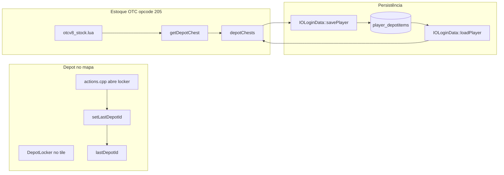

# Sistema de depot TFS — persistência e armadilhas

Documento de referência para **qualquer** feature que mova itens para o depot (Estoque opcode 205, scripts Lua, C++). Ler antes de alterar `iologindata.cpp`, `player.cpp`, `actions.cpp` ou `otcv8_stock.lua`.

Relacionado: [STOCK-MODULE.md](./STOCK-MODULE.md) (UI Estoque OTC), [AGENT-GUIDE.md](./AGENT-GUIDE.md) (lições anti-regressão).

---

## Visão geral

| Camada | O quê | Onde |
|--------|-------|------|
| **RAM (sessão)** | `Player::depotChests` — mapa `depotId → DepotChest*` | `src/player.h`, `src/player.cpp` |
| **Flag de UI** | `Player::lastDepotId` — último locker aberto no mapa | `src/player.h`, setado em `src/actions.cpp` |
| **Banco** | Tabela `player_depotitems` (MariaDB `global`) | `src/iologindata.cpp` load/save |
| **Estoque OTC** | Lua move itens via `player:getDepotChest(box, true)` | `data/lib/otcv8_stock.lua` — **não** seta `lastDepotId` |

**Não existe** tabela `stock` separada. O Estoque é um **frontend OTC** sobre o depot TFS normal.

---

## Fluxo de dados



---

## Estruturas C++ importantes

### `depotChests` (`std::map<uint32_t, DepotChest*>`)

- Criado sob demanda: `Player::getDepotChest(depotId, autoCreate)`.
- `autoCreate=true` (Estoque): cria chest em RAM mesmo sem abrir locker no mapa.
- Boxes **1–17** (config `depotBoxes`); id **0** = depot principal agregado em `getDepotBox()`.
- Limite por chest: `getMaxDepotItems()` / `maxDepotItems` em `config.lua`.

### `lastDepotId` (`int16_t`, default **-1**)

- Setado **somente** ao usar depot locker no mapa:

```312:312:src/actions.cpp
			player->setLastDepotId(depot->getDepotId());
```

- **Não** é alterado pelo Estoque OTC, scripts Lua genéricos, nem por `getDepotChest()` sozinho.
- **Não** existe binding Lua `player:setLastDepotId()` — patch só em Lua **não** substitui fix em `iologindata.cpp`.

### Tabela `player_depotitems`

| Coluna | Significado |
|--------|-------------|
| `player_id` | FK → `players.id` |
| `pid` | Depot box (0–17) ou pid de container pai |
| `sid` | ID serial do item na árvore |
| `itemtype` / `count` / `attributes` | Item TFS padrão |

Comentário no schema: `pid` 0–100 reservado para estrutura depot; filhos usam `pid` = `sid` do pai.

---

## Load e save (`src/iologindata.cpp`)

### Load (login)

1. `SELECT ... FROM player_depotitems WHERE player_id = ?`
2. Para cada item com `pid` em 0–99: `player->getDepotChest(pid, true)` + `internalAddThing`.
3. Popula `depotChests` a partir do banco.

### Save (logout / `player:save()`)

1. Sempre grava `player_items` (inventário slots 1–10 + mochila).
2. Grava `player_depotitems` **somente se**:

```815:815:src/iologindata.cpp
	if (player->lastDepotId != -1 || !player->depotChests.empty()) {
```

3. Save de depot: `DELETE` + `INSERT` de **todos** os boxes em `depotChests`.

**Regra crítica:** nunca reverter para só `lastDepotId != -1`. Jogadores que usam **apenas** Estoque OTC preenchem `depotChests` com `lastDepotId == -1`; sem a condição `|| !depotChests.empty()` os itens somem no relog.

---

## Estoque OTC (opcode 205)

| Ação | Comportamento |
|------|----------------|
| `deposit` / `depositAll` | Move da mochila → `getDepotChest(box, true)` |
| `withdraw` | Remove do depot → inventário/mochila (`tryCreateItemsInCylinder` se `moveTo` falhar) |
| `request` / catálogo | Lê **RAM** (`depotChests`) — UI pode parecer OK mesmo se save falhar |
| `depositAll` | Só varre **mochila** (não equipamentos no corpo) |

Diagnóstico in-game: `!estoque` (`data/talkactions/scripts/estoque_debug.lua`).

Cliente: `otcv8-dev-orig/modules/game_stock/` — **Ctrl+Shift+E**.

---

## Bug histórico (maio/2026)

| Etapa | O que acontecia |
|-------|-----------------|
| Deposit all via Estoque | Itens em `depotChests` (RAM), catálogo OK |
| Logout | `player_items` salva mochila vazia; **depot não salvo** (`lastDepotId == -1`) |
| Login | Carrega depot **antigo** do DB → perda permanente |

**Sintoma enganoso:** na sessão bugada a UI mostrava tudo; após relog sumia. **Nunca** validar persistência só pela UI.

**Fix validado:** condição dupla em `iologindata.cpp` (acima) + rebuild `tfs.exe`.

---

## O que o agente NÃO deve fazer

| Erro | Por quê |
|------|---------|
| Reverter save para só `lastDepotId != -1` | Quebra Estoque OTC sem abrir locker |
| Assumir que deposit Lua “já salvou” | Save ocorre no logout/`player:save()` |
| Confiar só no catálogo Estoque pós-deposit | Catálogo lê RAM; validar SQL |
| Criar tabela `stock` paralela | Duplicaria fonte de verdade; use depot TFS |
| Patch Lua tentando setar `lastDepotId` | API não exposta; correção é C++ |
| Esquecer rebuild após mudar `iologindata.cpp` | Servidor antigo continua perdendo itens |

---

## Diagnóstico SQL

Substituir `<guid>` pelo `players.id` do personagem:

```sql
-- Contagem de linhas no depot (não confundir com “quantidade de itens stackáveis”)
SELECT COUNT(*) AS depot_rows FROM player_depotitems WHERE player_id = <guid>;

-- Inventário persistido
SELECT COUNT(*) AS inv_rows FROM player_items WHERE player_id = <guid>;

-- Amostra depot
SELECT pid, sid, itemtype, count FROM player_depotitems
WHERE player_id = <guid> ORDER BY pid, sid LIMIT 20;
```

MySQL local (XAMPP):

```powershell
& "C:\xampp\mysql\bin\mysql.exe" -u root -e "USE global; SELECT COUNT(*) FROM player_depotitems WHERE player_id = <guid>;"
```

---

## Checklist de regressão (obrigatório)

Após **qualquer** mudança em save/load de depot ou Estoque:

1. **Teste A:** char **sem** abrir depot no mapa → Estoque → depositar tudo → logout → login → catálogo igual.
2. **Teste B:** SQL antes/depois do logout — `player_depotitems` **aumenta** após deposit.
3. **Teste C:** withdraw parcial → relog → item no inventário.
4. **Teste D:** depot cheio (`maxDepotItems`) → deposit retorna erro; mochila intacta.
5. **Teste E (mapa):** abrir locker → depositar/retirar → relog — comportamento clássico intacto.

---

## Rebuild vs Lua

| Alterou | Ação |
|---------|------|
| `src/iologindata.cpp`, `player.cpp`, `actions.cpp` | Recompilar `tfs.exe`, `deploy-runtime-dlls.ps1`, reiniciar |
| `data/lib/otcv8_stock.lua` | Reiniciar TFS ou `/reload creaturescripts` |
| `otcv8-dev-orig/modules/game_stock/` | Reiniciar `otclient_gl.exe` |

`player:save()` existe em Lua (`Player:save`) e chama `IOLoginData::savePlayer` — útil para testes, mas fluxo normal é logout.

---

## Arquivos de referência

| Arquivo | Papel |
|---------|--------|
| `src/iologindata.cpp` ~453–483 | Load depot |
| `src/iologindata.cpp` ~815–837 | Save depot |
| `src/player.cpp` ~812–835 | `getDepotChest` |
| `src/actions.cpp` ~307–312 | Abrir locker → `setLastDepotId` |
| `src/player.h` | `depotChests`, `lastDepotId` |
| `data/lib/otcv8_stock.lua` | Estoque OTC |
| `global.sql` | Schema `player_depotitems` |
